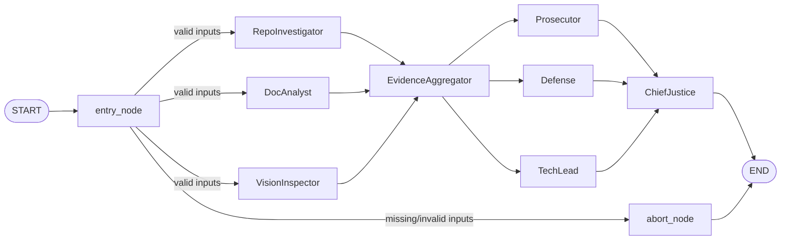

# Automaton Auditor

> Deep LangGraph swarm for autonomous repository and report auditing.

The Automaton Auditor ingests a GitHub repository URL and a PDF report, then runs a
**parallel detective swarm** to collect structured evidence across multiple rubric dimensions,
followed by a **judicial layer** (Prosecutor, Defense, TechLead) and a **Chief Justice** node
that produces a scored audit report.

---

## Architecture



**Detective layer:** `entry_node` fans out to three parallel detective branches; all converge at `EvidenceAggregator`.  
**Judicial layer:** Aggregated evidence fans out to Prosecutor, Defense, and TechLead; all converge at `ChiefJustice` for dialectical scoring and conflict resolution.  
**Conditional edges:** Invalid inputs short-circuit to `END` via `abort_node`.

---

## Setup

**Requirements:** Python 3.13+, [uv](https://docs.astral.sh/uv/)

```bash
git clone https://github.com/your-org/LangGraph-Automation-Auditor
cd LangGraph-Automation-Auditor

uv sync

cp .env.example .env
# Edit .env and fill in your API keys
```

---

## Environment Variables

| Variable | Required | Used by |
|---|---|---|
| `LANGCHAIN_TRACING_V2` | No | LangSmith observability |
| `LANGCHAIN_API_KEY` | No | LangSmith tracing |
| `ANTHROPIC_API_KEY` | For detectives/judges | Detective and judicial agents |
| `GOOGLE_API_KEY` | Alternative | VisionInspector (Gemini 2.5 Flash, recommended) |
| `OPENAI_API_KEY` | Alternative | VisionInspector (GPT-4o-mini) |
| `VISION_ENABLED` | No | Set `true` to enable diagram analysis |
| `DETECTIVE_MODEL` | No | Override LLM for detectives |
| `JUDICIAL_MODEL` | No | Override LLM for judges |
| `CHIEF_JUDGE_MODEL` | No | Override LLM for Chief Justice |
| `DETECTIVE_MAX_ITERATIONS` | No | Max iterations per detective call |

At least one of `ANTHROPIC_API_KEY`, `GOOGLE_API_KEY`, or `OPENAI_API_KEY` is needed for vision and judicial layers. RepoInvestigator and DocAnalyst can run without an LLM key for basic tool-only analysis.

---

## Running

**Full run (detective → judicial → Chief Justice):**

```bash
uv run python main.py \
  --repo-url https://github.com/your-org/your-repo \
  --pdf-path docs/report/interim_report.pdf
```

**Skip detective stage** — feed saved evidence straight into the judicial layer:

```bash
uv run python main.py --evidence-path output/evidence_20260228_030516.json
```

**Resume a crashed run** (reuses checkpoint; skips completed nodes):

```bash
uv run python main.py --repo-url ... --pdf-path ... --thread-id audit-20260227-165030
```

**Suppress real-time agent trace** (only final summary is printed):

```bash
uv run python main.py --repo-url ... --pdf-path ... --quiet
```

### CLI Options

| Option | Description |
|--------|-------------|
| `--repo-url` | GitHub repo URL (https or git@) |
| `--pdf-path` | Path to the PDF report |
| `--evidence-path` | Skip detectives; load evidence from JSON and run judicial layer only |
| `--branch`, `-b` | Branch, tag, or commit SHA to clone (default: remote HEAD) |
| `--depth` | Shallow-clone depth (default: 50; use 0 for full clone) |
| `--output` | Where to write evidence JSON (default: `output/evidence.json`) |
| `--thread-id` | Resume a previous run using its checkpoint thread ID |
| `--quiet` | Suppress real-time agent trace |
| `--help-docker` | Print Docker run example and exit |

---

## Docker

Build the image (from the project root):

```bash
docker build -t automaton-auditor:dev .
```

Run with volume mounts:

```bash
docker run --rm \
  -v "$(pwd)/docs/report:/app/reports" \
  -v "$(pwd)/output:/app/output" \
  automaton-auditor:dev \
  --repo-url https://github.com/owner/repo \
  --pdf-path /app/reports/interim_report.pdf \
  --output /app/output/evidence.json
```

For a copy-paste example and path notes:

```bash
docker run --rm automaton-auditor:dev --help-docker
```

---

## Testing

```bash
uv run pytest
```

Tests cover `src/tools` (repo, doc, vision), `src/nodes` (detectives, judges, justice), `src/graph`, `main.py`, spend tracker, and `md_to_pdf`. Use `uv run pytest -v` for verbose output.

---

## Output

Each run produces:

- **Evidence JSON** — Structured evidence per rubric dimension (written to `--output` and a timestamped copy)
- **Audit report Markdown** — Scored report with executive summary, criterion scores, and remediation plan (e.g. `output/audit_report_20260228_174705.md`)

Example stdout summary:

```
── Evidence Summary ─────────────────────────────────────────────

[REPO]
  ✓ git_forensic_analysis              confidence=0.85
  ✓ state_management_rigor             confidence=0.90
  ...

── Audit Report ─────────────────────────────────────────────────
  Overall score : 4.20 / 5.00
  Executive summary: ...
```

---

## Generating PDF from Markdown

Reports and docs that contain ` ```mermaid ` diagrams can be turned into a single PDF: Mermaid blocks are rendered to images with [mermaid-cli](https://github.com/mermaid-js/mermaid-cli), then [pandoc](https://pandoc.org/) produces the PDF.

**Requirements:** `pandoc`, and either `mmdc` (mermaid-cli) or `npx`:

```bash
# Optional: install mermaid-cli globally (otherwise the script uses npx)
npm install -g @mermaid-js/mermaid-cli
```

**Build PDF (default: `reports/final_report.md` → `reports/final_report.pdf`):**

```bash
make pdf
```

**Custom input/output:**

```bash
make pdf INPUT=output/audit_report_20260228_033714.md OUTPUT=output/audit.pdf
make pdf INPUT=README.md OUTPUT=docs/readme.pdf
```

**Script only (no Makefile):**

```bash
uv run python scripts/md_to_pdf.py reports/final_report.md -o reports/final_report.pdf \
  --metadata docs/report/templates/pdf-metadata-final.yaml
```

Options: `--build-dir`, `--image-format png|svg`, `--skip-mermaid` (only run pandoc). Run `python scripts/md_to_pdf.py --help` for details.

---

## Project Structure

```
src/
├── state.py              # Evidence, JudicialOpinion, AuditReport, AgentState + reducers
├── graph.py              # Compiled LangGraph StateGraph (detective + judicial layers)
├── tools/
│   ├── repo_tools.py     # Sandboxed clone, git log, AST graph analysis
│   ├── doc_tools.py      # PDF ingest, TF-ranked query, file path extractor
│   └── vision_tools.py   # Image extraction + multimodal diagram classifier
├── nodes/
│   ├── detectives.py     # RepoInvestigator, DocAnalyst, VisionInspector nodes
│   ├── judges.py        # Prosecutor, Defense, TechLead (structured JudicialOpinion)
│   └── justice.py       # ChiefJusticeNode (deterministic conflict resolution)
└── utils/
    ├── report_writer.py  # Markdown serialization for AuditReport
    └── spend_tracker.py # Token/spend tracking
main.py                   # CLI entrypoint
scripts/
└── md_to_pdf.py         # Markdown → Mermaid images (mmdc) → Pandoc PDF
Makefile                  # make pdf, check-deps, clean
docs/
├── report/               # Interim/final PDF reports
├── explanation/          # How-the-program-runs and other explainers
└── rubric.json           # Rubric dimensions (optional)
tests/                    # Pytest suite (tools, nodes, graph, main, spend_tracker, md_to_pdf)
output/                   # Evidence JSON and audit reports (.gitignore)
Dockerfile, .dockerignore  # Container build and run
```
