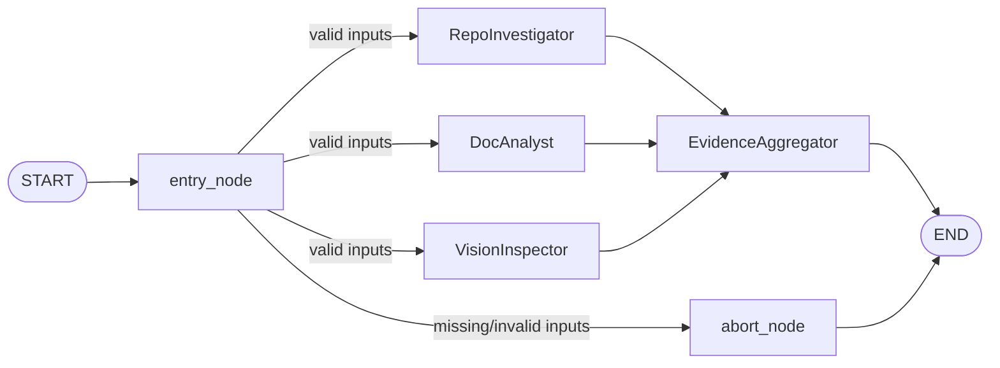
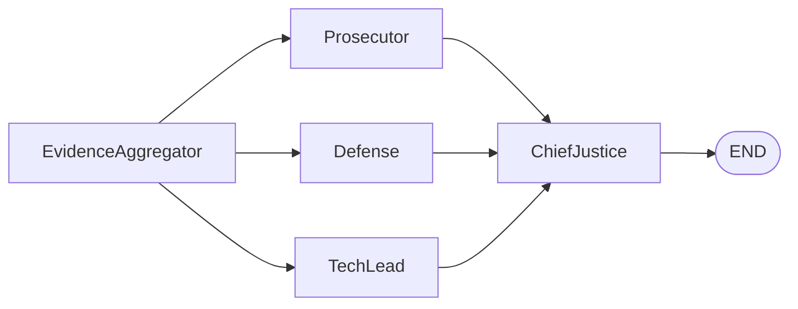

# Automaton Auditor

> Deep LangGraph swarm for autonomous repository and report auditing.

The Automaton Auditor ingests a GitHub repository URL and a PDF report, then runs a
**parallel detective swarm** to collect structured evidence across multiple rubric dimensions.

---

## Architecture (Interim)



**Fan-out:** `entry_node` fans out to three parallel detective branches.  
**Fan-in:** All three branches converge at `EvidenceAggregator`.  
**Conditional edges:** Invalid inputs short-circuit to `END` via `abort_node`.

### Planned Final Architecture



---

## Setup

**Requirements:** Python 3.13+, [uv](https://docs.astral.sh/uv/)

```bash
git clone https://github.com/your-org/LangGraph-Automation-Auditor
cd LangGraph-Automation-Auditor

uv sync

cp .env.example .env
# Edit .env and fill in your API keys
```

---

## Environment Variables

| Variable | Required | Used by |
|---|---|---|
| `LANGCHAIN_TRACING_V2` | No | LangSmith observability |
| `LANGCHAIN_API_KEY` | No | LangSmith tracing |
| `ANTHROPIC_API_KEY` | For vision | VisionInspector (Claude 3.5 Haiku) |
| `OPENAI_API_KEY` | Alternative | VisionInspector (GPT-4o-mini) |

At least one of `ANTHROPIC_API_KEY` or `OPENAI_API_KEY` is needed for diagram analysis.
All other detectives (RepoInvestigator, DocAnalyst) run without an LLM key.

---

## Running

```bash
uv run python main.py \
  --repo-url https://github.com/your-org/your-repo \
  --pdf-path docs/report/interim_report.pdf
```

- **`--repo-url`** — GitHub repo URL (https or git@).
- **`--pdf-path`** — Path to the PDF report (e.g. `docs/report/interim_report.pdf`).
- **`--output`** — Where to write evidence JSON (default: `output/evidence.json`).
- **`--help-docker`** — Print Docker run example with volume mounts and exit.

Example with custom output path:

```bash
uv run python main.py \
  --repo-url https://github.com/your-org/your-repo \
  --pdf-path docs/report/interim_report.pdf \
  --output output/my_evidence.json
```

---

## Docker

Build the image (from the project root):

```bash
docker build -t automaton-auditor:dev .
```

Run with volume mounts so the container can read your PDF and write evidence (paths are inside the container):

```bash
docker run --rm \
  -v "$(pwd)/docs/report:/app/reports" \
  -v "$(pwd)/output:/app/output" \
  automaton-auditor:dev \
  --repo-url https://github.com/owner/repo \
  --pdf-path /app/reports/interim_report.pdf \
  --output /app/output/evidence.json
```

For a copy-paste example and path notes, run:

```bash
docker run --rm automaton-auditor:dev --help-docker
```

---

## Testing

```bash
uv run pytest
```

Tests cover `src/tools` (repo, doc, vision), `src/nodes/detectives`, and `src/graph`. Use `uv run pytest -v` for verbose output.

---

## Output

The run prints a summary table to stdout and saves a JSON file. The following is a sample output:

```
── Evidence Summary ─────────────────────────────────────────────

[REPO]
  ✓ git_forensic_analysis              confidence=0.85
      32 commits found. Progression detected: True. Detected phases: setup, tools, nodes ...
  ✓ state_management_rigor             confidence=0.90
      Pydantic BaseModel: True, TypedDict: True, Reducers: True ...
  ✓ graph_orchestration                confidence=0.90
      Detected 5 nodes, 7 edges. Fan-out: True, Fan-in: True ...
  ✓ safe_tool_engineering              confidence=0.95
      URL validated, tempfile used, subprocess.run with explicit arg list ...

[DOC]
  ✓ theoretical_depth                  confidence=0.83
      5/6 rubric concepts mentioned ...
  ✓ report_accuracy                    confidence=0.75
      8 file paths mentioned; 6 verified, 2 not found on disk ...

[VISION]
  ✓ swarm_visual                       confidence=0.90
      Diagram classification: accurate_stategraph ...
```

---

## Generating PDF from Markdown

Reports and docs that contain ` ```mermaid ` diagrams can be turned into a single PDF: Mermaid blocks are rendered to images with [mermaid-cli](https://github.com/mermaid-js/mermaid-cli), then [pandoc](https://pandoc.org/) produces the PDF.

**Requirements:** `pandoc`, and either `mmdc` (mermaid-cli) or `npx`:

```bash
# Optional: install mermaid-cli globally (otherwise the script uses npx)
npm install -g @mermaid-js/mermaid-cli
```

**Build PDF (default: `reports/final_report.md` → `reports/final_report.pdf`):**

```bash
make pdf
```

**Custom input/output:**

```bash
make pdf INPUT=output/audit_report_20260228_033714.md OUTPUT=output/audit.pdf
make pdf INPUT=README.md OUTPUT=docs/readme.pdf
```

**Script only (no Makefile):**

```bash
uv run python scripts/md_to_pdf.py reports/final_report.md -o reports/final_report.pdf \
  --metadata docs/report/templates/pdf-metadata-final.yaml
```

Options: `--build-dir`, `--image-format png|svg`, `--skip-mermaid` (only run pandoc). Run `python scripts/md_to_pdf.py --help` for details.

---

## Project Structure

```
src/
├── state.py              # Evidence, JudicialOpinion, AgentState + reducers
├── graph.py              # Compiled LangGraph StateGraph
├── tools/
│   ├── repo_tools.py     # Sandboxed clone, git log, AST graph analysis
│   ├── doc_tools.py      # PDF ingest, TF-ranked query, file path extractor
│   └── vision_tools.py   # Image extraction + multimodal diagram classifier
└── nodes/
    └── detectives.py     # RepoInvestigator, DocAnalyst, VisionInspector nodes
main.py                   # CLI entrypoint
scripts/
└── md_to_pdf.py          # Markdown → Mermaid images (mmdc) → Pandoc PDF
Makefile                  # make pdf, check-deps, clean
docs/
├── report/               # Interim/final PDF reports (e.g. interim_report.pdf)
├── explanation/          # How-the-program-runs and other explainers
├── interim-submission-plan.md
└── COMMIT_PLAN.md        # Atomic commit / branch plan for this repo
tests/                    # Pytest suite (tools, nodes, graph)
output/                   # Evidence JSON outputs (.gitignore)
Dockerfile, .dockerignore # Container build and run
```

---

## Known Gaps (Final Submission)

The following are **not yet built** and are planned for the final submission:

- `src/nodes/judges.py` — Prosecutor, Defense, TechLead with `.with_structured_output(JudicialOpinion)`
- `src/nodes/justice.py` — ChiefJusticeNode with deterministic conflict resolution rules
- `rubric.json` + ContextBuilder/Dispatcher — dynamic rubric loading for judges
- Full graph wiring — judge fan-out/fan-in, ChiefJustice → END, Markdown report output
- `reports/final_report.pdf`, LangSmith trace link, video demo
