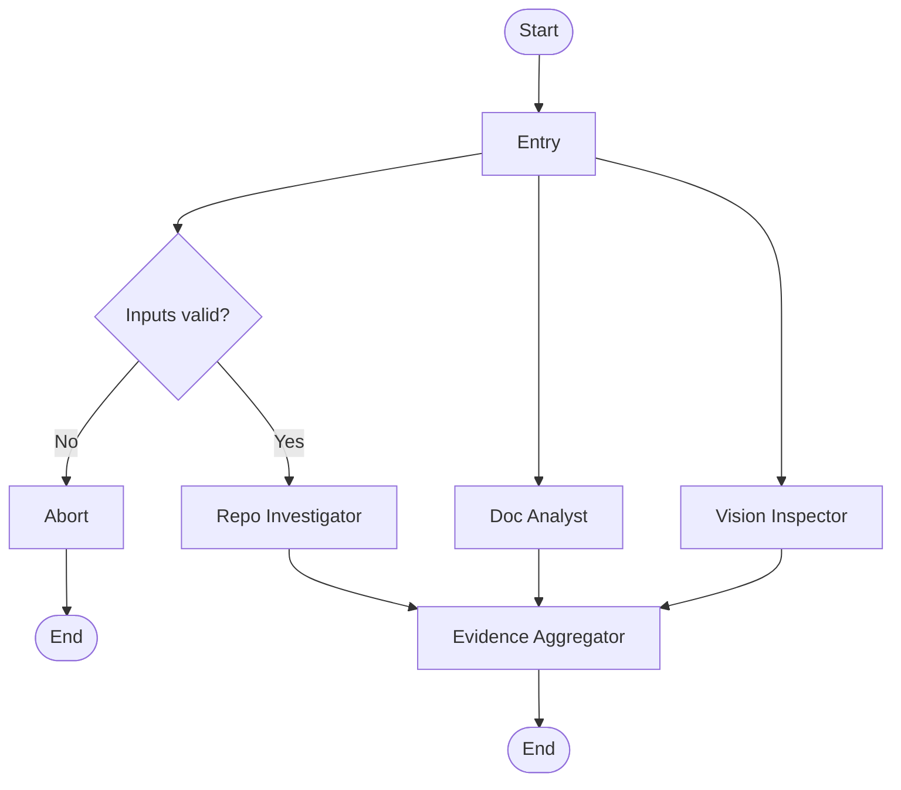
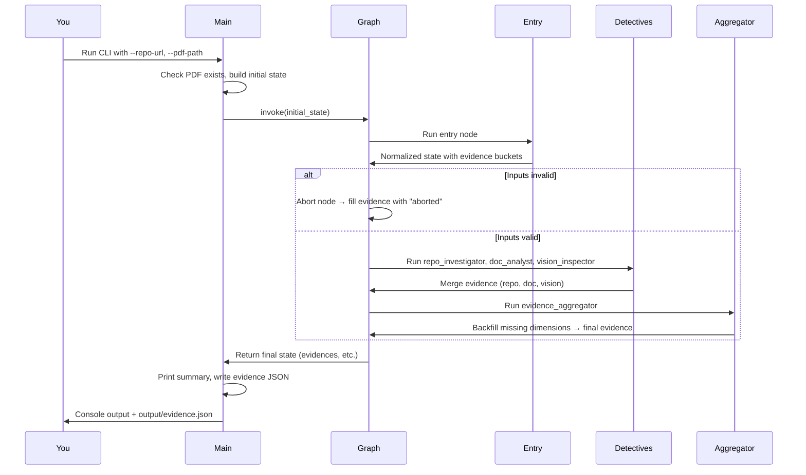

# How the Automaton Auditor Runs (Start to Finish)

This document walks through how the program runs from the moment you start it until it finishes. It avoids jargon where possible and uses diagrams to show the flow.

---

## The Big Picture

The **Automaton Auditor** checks a GitHub repository and a PDF report against a set of criteria (a “rubric”). It does this in stages:

1. **Detectives** — Three “detective” steps look at different things (the repo code, the PDF text, and diagrams in the PDF) and each produces **evidence**.
2. **Evidence aggregation** — All that evidence is collected and normalized into one place.
3. **Judges and final report** *(planned, not yet in the graph)* — In the full design, judges would score the evidence and a “Chief Justice” would produce a final audit report. Right now the program stops after evidence collection.

When you run the program, you only go through the detective stage and evidence aggregation; the rest is prepared in the code but not wired into the graph yet.

---

## Where It All Starts: `main.py`

You run the program from the command line, for example:

```bash
uv run python main.py --repo-url https://github.com/... --pdf-path reports/interim_report.pdf
```

### Step 1: Parse your inputs

The program reads what you typed:

- **`--repo-url`** — The GitHub repository to audit (must start with `https://` or `git@`).
- **`--pdf-path`** — The path to the PDF report to analyse (e.g. your interim report).
- **`--output`** *(optional)* — Where to save the evidence as JSON (default: `output/evidence.json`).

If the PDF file does not exist, the program prints an error and exits. Otherwise it continues.

### Step 2: Build the initial “state”

The program prepares a single bundle of data that will be passed through the whole workflow. This bundle is called the **state**. Initially it contains:

| Field              | What it holds                                      |
|--------------------|----------------------------------------------------|
| `repo_url`         | The repo URL you passed in                         |
| `pdf_path`         | The path to the PDF                                |
| `rubric_dimensions`| Empty for now (used later for dynamic rubrics)     |
| `evidences`        | Empty — detectives will fill this                  |
| `opinions`         | Empty — for future judge outputs                   |
| `final_report`     | `None` — for the future final report               |

### Step 3: Run the graph and show results

The program loads the **graph** (the workflow definition), runs it once with that initial state, and gets back the **final state** after all steps.

Then it:

- Prints a short **evidence summary** to the screen (which criteria passed or failed, with confidence).
- Saves the full evidence to a JSON file (by default `output/evidence.json`).

So in one sentence: **main.py turns your CLI arguments into state, runs the graph once, then prints and saves the evidence.**

---

## High-Level Flow Diagram

```
┌─────────────────────────────────────────────────────────────────────────────┐
│  YOU                                                                        │
│  Run: python main.py --repo-url <url> --pdf-path <path>                     │
└─────────────────────────────────────────────────────────────────────────────┘
                                        │
                                        ▼
┌─────────────────────────────────────────────────────────────────────────────┐
│  main.py                                                                    │
│  • Check PDF exists                                                         │
│  • Build initial state (repo_url, pdf_path, empty evidences, etc.)          │
│  • graph.invoke(initial_state)  ──────────────────────────────────────────► │
└─────────────────────────────────────────────────────────────────────────────┘
                                        │
                                        ▼
┌─────────────────────────────────────────────────────────────────────────────┐
│  GRAPH (see next section)                                                   │
│  Entry → (maybe abort) or → 3 detectives → evidence aggregator → END         │
└─────────────────────────────────────────────────────────────────────────────┘
                                        │
                                        ▼
┌─────────────────────────────────────────────────────────────────────────────┐
│  main.py (continued)                                                        │
│  • Read result["evidences"] from final state                                │
│  • Print evidence summary to console                                        │
│  • Write evidence JSON to --output file                                     │
└─────────────────────────────────────────────────────────────────────────────┘
```

---

## What Happens Inside the Graph

The graph is a **state machine**: it moves from one “node” (step) to the next, and each step can read and update the shared state.

### Graph flow (diagram)



### Step-by-step

1. **Start → Entry**  
   The first step is **Entry**. It cleans your inputs (e.g. trims spaces) and makes sure the evidence storage has the right “buckets” (repo, doc, vision) so later steps can fill them safely.

2. **Entry → Decision**  
   A small check runs:  
   - Are both `repo_url` and `pdf_path` non-empty?  
   - Does `repo_url` start with `https://` or `git@`?  
   If **no** → the graph goes to **Abort**.  
   If **yes** → the graph continues to the detectives.

3. **Abort (only if inputs are bad)**  
   If the program took the “abort” path, one special step runs. It fills the evidence with “nothing found” for every criterion and a short reason (“Aborted: missing or invalid repo_url / pdf_path.”). Then the graph ends. So even when you give bad inputs, you still get a consistent evidence structure, not a crash.

4. **Three detectives (when inputs are good)**  
   When inputs are valid, three steps run (and can run in parallel in practice):
   - **Repo Investigator** — Clones the repo, looks at git history, inspects `src/state.py` and `src/graph.py`, and checks that cloning is done safely. It produces evidence for: git forensics, state management, graph structure, and safe tool use.
   - **Doc Analyst** — Opens the PDF, searches the text for rubric-related content, and checks whether file paths mentioned in the PDF actually exist. It produces evidence for: theoretical depth and report accuracy.
   - **Vision Inspector** — Pulls images/diagrams from the PDF and uses a vision model to classify them (e.g. “does this look like a state graph?”). It produces evidence for: swarm/visual quality.

   Each detective writes its evidence into the shared state. The way the state is set up, their results are **merged** (not overwritten), so all three contribute to the same evidence structure.

5. **Evidence Aggregator**  
   After all detectives finish, the **Evidence Aggregator** runs. It:
   - Ensures every expected rubric dimension has at least one evidence entry.
   - If a detective didn’t report something for a dimension, it adds a “no evidence” placeholder so the structure is complete.

   When this step is done, the graph ends.

6. **End**  
   Control returns to `main.py` with the final state. The only part `main.py` uses is `evidences`; it prints a summary and writes the JSON file.

---

## What Is Implemented vs Planned

| Part of the design              | Status in the graph |
|---------------------------------|---------------------|
| Entry, input check, abort path  | Implemented         |
| Repo Investigator               | Implemented         |
| Doc Analyst                     | Implemented         |
| Vision Inspector                | Implemented         |
| Evidence Aggregator             | Implemented         |
| Judges (Prosecutor, Defense, Tech Lead) | Not in graph yet   |
| Chief Justice (final scores & report)  | Not in graph yet   |
| Final audit report output       | Not in graph yet    |

The state and data structures (e.g. `JudicialOpinion`, `AuditReport`) are already defined so that judges and the Chief Justice can be added later without changing the evidence format. For now, “end of the graph” means “after Evidence Aggregator”; the program then only uses the **evidence** to print and save results.

---

## Summary Diagram: From Your Command to the Output File



---

## Credits

This project is the Automaton Auditor. The explanation above describes the program as it runs from `main.py` through the current graph; the judicial layer and final report are designed but not yet wired into the graph.
