# Automaton Auditor — Interim Architecture Report

*Automaton Auditor · Interim Submission*

---

## Table of Contents

1. [Project Overview](#1-project-overview)
2. [Architecture Decisions](#2-architecture-decisions)
   - [2.1 Why Pydantic + TypedDict over Plain Dicts](#21-why-pydantic--typeddict-over-plain-dicts)
   - [2.2 State Reducers: Preventing Parallel Overwrites](#22-state-reducers-preventing-parallel-overwrites)
   - [2.3 AST Parsing Strategy](#23-ast-parsing-strategy)
   - [2.4 Sandboxing Strategy for Repository Cloning](#24-sandboxing-strategy-for-repository-cloning)
   - [2.5 PDF Ingestion: RAG-Lite Without a Vector Store](#25-pdf-ingestion-rag-lite-without-a-vector-store)
   - [2.6 Vision Analysis: Graceful Degradation](#26-vision-analysis-graceful-degradation)
3. [Interim StateGraph Flow](#3-interim-stategraph-flow)
   - [3.1 Node Topology](#31-node-topology)
   - [3.2 Conditional Edge Logic](#32-conditional-edge-logic)
   - [3.3 State Data Flow](#33-state-data-flow)
4. [Rubric Dimension Coverage](#4-rubric-dimension-coverage)
5. [Known Gaps and Plan for Final Submission](#5-known-gaps-and-plan-for-final-submission)
   - [5.1 Judicial Layer](#51-judicial-layer)
   - [5.2 Chief Justice Synthesis Engine](#52-chief-justice-synthesis-engine)
   - [5.3 Dynamic Rubric Loading](#53-dynamic-rubric-loading)
   - [5.4 Complete Graph Wiring](#54-complete-graph-wiring)
6. [Planned Final Architecture](#6-planned-final-architecture)
7. [Environment and Observability](#7-environment-and-observability)

---

## 1. Project Overview

The **Automaton Auditor** is a hierarchical multi-agent system built on LangGraph. It accepts a GitHub repository URL and a PDF report as inputs and produces structured forensic evidence across rubric dimensions — verifying code artifacts, architectural patterns, documentation quality, and visual diagrams.

The system is structured as a **Digital Courtroom**: detective agents collect objective evidence, judicial agents apply competing interpretive lenses to that evidence, and a Chief Justice synthesizes a final, deterministic verdict.

This document covers the interim state of the system, corresponding to the Detective Layer (Layer 1) only. The Judicial Layer (Layer 2) and Supreme Court (Layer 3) are designed and planned but not yet implemented.

---

## 2. Architecture Decisions

### 2.1 Why Pydantic + TypedDict over Plain Dicts

The state management layer uses a hybrid of `TypedDict` (for the graph-level `AgentState`) and Pydantic `BaseModel` (for nested value objects like `Evidence`, `JudicialOpinion`, `CriterionResult`, and `AuditReport`).

**The problem with plain dicts:**

```python
# Fragile: no schema, no validation, silent bugs
state = {"evidences": {"repo": [{"found": True, "confidence": "high"}]}}
```

- Keys can be misspelled silently.
- Values have no type constraints — `confidence: "high"` instead of `0.9` is accepted at runtime.
- Parallel nodes writing to the same key will overwrite each other's data with no indication of failure.
- No `.model_dump()` serialisation for output JSON.

**The chosen approach:**

```python
class Evidence(BaseModel):
    goal: str
    found: bool
    content: Optional[str]
    location: str
    rationale: str
    confidence: float = Field(ge=0.0, le=1.0)
```

Every detective node constructs `Evidence` objects. Pydantic enforces the `ge=0.0, le=1.0` range on `confidence` at instantiation time — not at test time. `JudicialOpinion.score` is similarly constrained to `ge=1, le=5`, making it impossible for a judge to emit a score of `0` or `6` without raising a `ValidationError`.

`AgentState` is a `TypedDict` rather than a Pydantic model because LangGraph's `StateGraph` requires a `TypedDict`-compatible schema for its state channel system.

**Type hierarchy:**

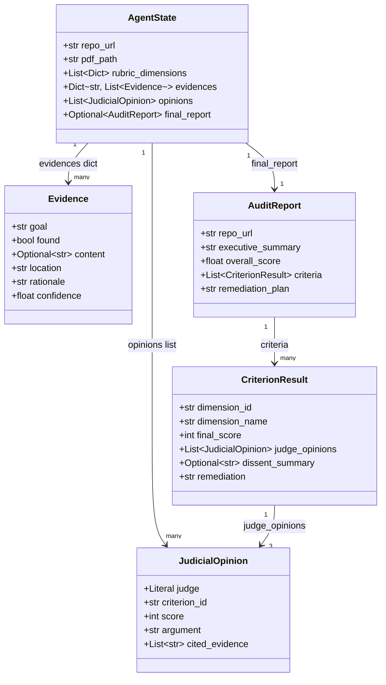

---

### 2.2 State Reducers: Preventing Parallel Overwrites

When three detective nodes run in parallel, each writes into `state["evidences"]`. Without a reducer, the last node to finish silently clobbers the other two nodes' results — a race condition that produces no error and no warning.

LangGraph resolves this with `Annotated` type hints on the state fields:

```python
class AgentState(TypedDict):
    evidences: Annotated[Dict[str, List[Evidence]], operator.ior]
    opinions: Annotated[List[JudicialOpinion], operator.add]
```

- `operator.ior` (`|=`) performs a **dict merge**: each parallel node writes into a separate key (`"repo"`, `"doc"`, `"vision"`), and the reducer combines all three dicts without any key colliding.
- `operator.add` performs **list concatenation**: judge opinions from three parallel judge nodes are concatenated into a single list.

**Without reducer (race condition):**

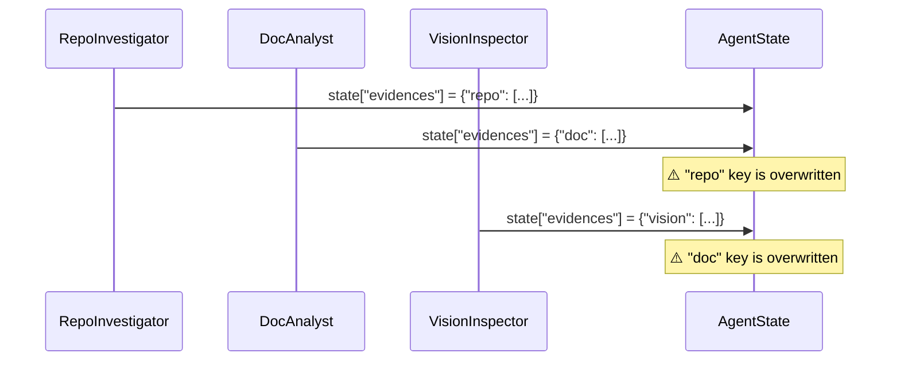

**With `operator.ior` reducer (correct merge):**

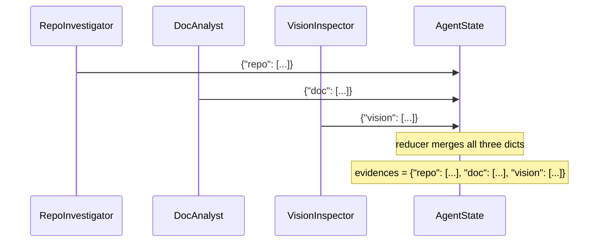

---

### 2.3 AST Parsing Strategy

The `analyze_graph_structure` function in `src/tools/repo_tools.py` uses Python's built-in `ast` module rather than regular expressions.

**Why not regex?**

Regex on source code is brittle. Consider these equivalent constructions:

```python
# Pattern A
builder.add_edge("entry", "repo_investigator")

# Pattern B
g = builder
g.add_edge(
    "entry",
    "repo_investigator"
)

# Pattern C — regex would miss this entirely
edges = [("entry", "repo_investigator")]
for src, dst in edges:
    builder.add_edge(src, dst)
```

A regex pattern for `add_edge\("(\w+)",\s*"(\w+)"\)` matches Pattern A but misses B and C. The AST visitor handles A and B correctly (Pattern C is intentionally out of scope as it requires data-flow analysis).

**AST visitor design:**

```python
class _GraphVisitor(ast.NodeVisitor):
    def visit_Call(self, node: ast.Call):
        func = node.func
        if isinstance(func, ast.Attribute):
            if func.attr == "add_node":       # → collect node name
            if func.attr == "add_edge":       # → collect (src, dst) tuple
            if func.attr == "add_conditional_edges":  # → increment counter
        self.generic_visit(node)
```

The visitor walks the full AST, so it catches nested calls, calls in helper functions, and calls across multiple builder variable names. The only hard requirement is that the string literal appears directly as the first argument (constant folding is not implemented — that covers the majority of LangGraph code patterns in practice).

**Error handling:**

- `SyntaxError` on `ast.parse()` → returns `GraphAnalysisResult(ok=False, error="parse_error: ...")`
- File not found → returns `ok=False, error="file_not_found"`
- `StateGraph` not found in AST → returns `ok=False, error="no_stategraph_found"`

None of these raise exceptions into the graph; the detective node catches them and emits `Evidence(found=False, ...)`.

**Fan-out and fan-in detection:**

```python
src_counts = Counter(src for src, _ in visitor.edges)
dst_counts = Counter(dst for _, dst in visitor.edges)
has_parallel = any(v >= 2 for v in src_counts.values())   # one src → many dst
has_fan_in   = any(v >= 2 for v in dst_counts.values())   # many src → one dst
```

---

### 2.4 Sandboxing Strategy for Repository Cloning

Cloning unknown repositories is a high-risk operation. The `clone_repo_sandboxed` function in `src/tools/repo_tools.py` applies four layers of protection:

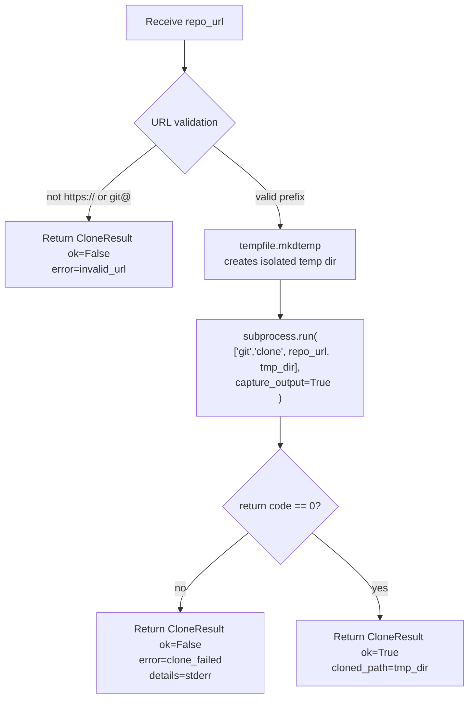

**Layer 1 — URL allow-listing:**
Only `https://` and `git@` prefixes are accepted. Any other value returns an error before any subprocess is spawned. This prevents injection strings like `; rm -rf /` embedded in a URL.

**Layer 2 — Temp directory isolation:**
`tempfile.mkdtemp()` creates a directory with a randomised name under the OS's temp path (e.g., `/tmp/auditor_clone_abc123`). The cloned repository never touches the working directory of the auditor process.

**Layer 3 — `subprocess.run` with an explicit argument list (no `shell=True`):**
When `shell=True` is used, the command string is passed to `/bin/sh -c`, which means shell metacharacters in `repo_url` are interpreted. An explicit argument list bypasses the shell entirely:

```python
# Vulnerable — shell interprets metacharacters in repo_url
subprocess.run(f"git clone {repo_url} {tmp}", shell=True)

# Safe — repo_url is passed as a literal argument to git
subprocess.run(["git", "clone", repo_url, tmp], capture_output=True)
```

**Layer 4 — Return-code checking and structured errors:**
`returncode != 0` is always checked. `stderr` is captured and returned inside `CloneResult.details`. No exception propagates to the graph.

---

### 2.5 PDF Ingestion: RAG-Lite Without a Vector Store

The `ingest_pdf` function uses PyMuPDF (`fitz`) to extract text page-by-page, then splits it into overlapping character-window chunks (~1800 characters, ~75% overlap between consecutive chunks).

**Why chunking instead of full-document context?**

LLM context windows are finite. A 30-page PDF with diagrams can exceed 40,000 tokens. Chunking allows targeted retrieval: instead of passing the entire PDF to an LLM, the `query_pdf` function uses a TF-score (term frequency) ranking to surface the top-k most relevant chunks for a given query.

**Chunk overlap:**

```
Page text: [----chunk_0----][25%_overlap][----chunk_1----][25%_overlap][----chunk_2----]
```

Overlapping by 25% prevents a rubric keyword from falling at a chunk boundary and being missed by both adjacent chunks.

**TF scoring (no external vector DB required):**

```python
def _tf_score(query_tokens, doc_tokens):
    score = sum(doc_tokens.count(qt) / len(doc_tokens) for qt in query_tokens)
    return score * math.log(1 + len(doc_tokens))
```

The log factor discounts extremely long chunks that would otherwise always win by sheer volume. This is sufficient for the rubric's keyword-anchored queries (`"Dialectical Synthesis"`, `"Fan-In Fan-Out"`, etc.) without adding a dependency on a vector database or embedding model.

---

### 2.6 Vision Analysis: Graceful Degradation

`VisionInspector` is designed so that the absence of a vision-capable API key never crashes the graph. The execution path degrades gracefully at each step:

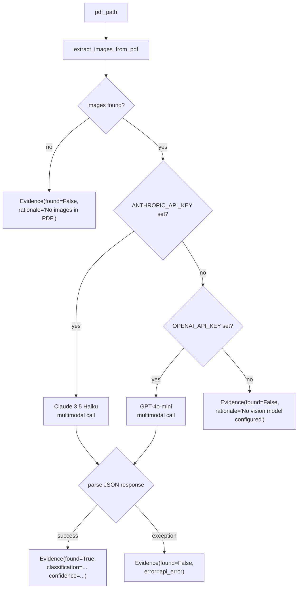

The vision model receives a structured prompt requesting a JSON response with `classification`, `description`, `has_parallel_branches`, and `confidence`. The five classification labels are aligned with the rubric's `swarm_visual` dimension:

| Label | Meaning |
|---|---|
| `accurate_stategraph` | Shows parallel fan-out/fan-in LangGraph nodes |
| `sequence_diagram` | UML sequence / step arrows |
| `generic_flowchart` | Flowchart without parallelism |
| `linear_pipeline` | Strictly sequential, no parallelism |
| `other` | Unclassifiable |

---

## 3. Interim StateGraph Flow

### 3.1 Node Topology

The interim graph implements **Layer 1 only**: the Detective Layer. The full judicial and synthesis layers are planned for the final submission.

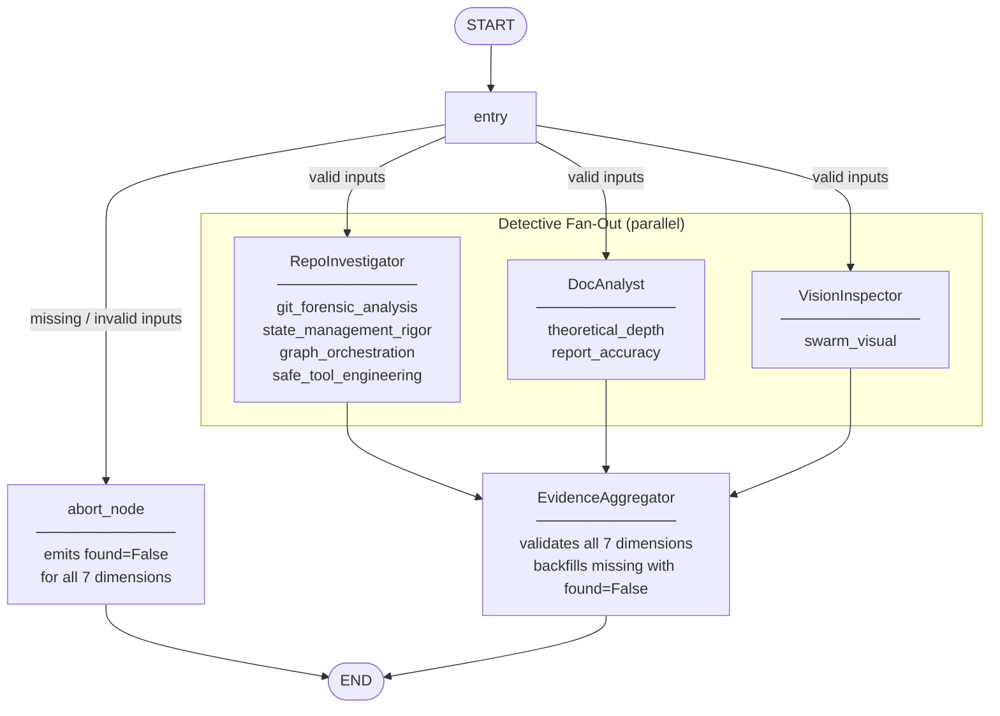

### 3.2 Conditional Edge Logic

The `entry_node` validates inputs before the detective fan-out:

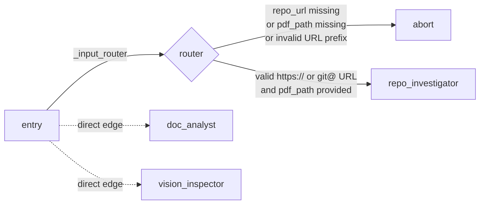

Note: `doc_analyst` and `vision_inspector` receive direct (non-conditional) edges from `entry` because they are independent of URL validity — the DocAnalyst and VisionInspector only require `pdf_path`. The conditional router gates only `RepoInvestigator`.

### 3.3 State Data Flow

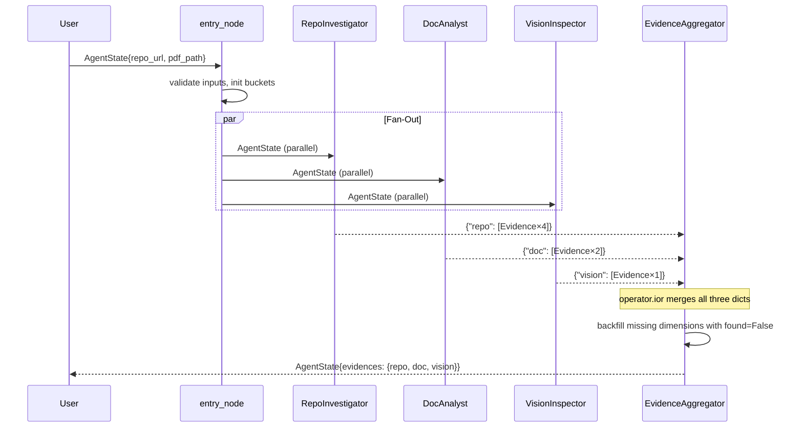

---

## 4. Rubric Dimension Coverage

The table below maps each rubric dimension to the detective node and tool function that collects it, along with the confidence heuristic applied:

| Dimension | Detective | Tool Function | Confidence Heuristic |
|---|---|---|---|
| `git_forensic_analysis` | RepoInvestigator | `extract_git_history` | 0.85 if ≥2 phases detected in commit messages; 0.4 otherwise |
| `state_management_rigor` | RepoInvestigator | AST scan of `src/state.py` | 0.9 if Pydantic + TypedDict + reducers all present; 0.5 otherwise |
| `graph_orchestration` | RepoInvestigator | `analyze_graph_structure` | 0.9 if fan-out AND fan-in detected; 0.5 otherwise |
| `safe_tool_engineering` | RepoInvestigator | `clone_repo_sandboxed` (self-audit) | 0.95 (constant — deterministic check) |
| `theoretical_depth` | DocAnalyst | `query_pdf` × 6 rubric queries | `matched_count / total_queries` |
| `report_accuracy` | DocAnalyst | `extract_file_paths_from_text` + path existence check | `verified_count / mentioned_count` |
| `swarm_visual` | VisionInspector | `extract_images_from_pdf` + `analyze_diagram` | LLM-reported confidence × 0.5 if not `accurate_stategraph` |

**Dimensions deferred to final submission** (Judicial Layer):

| Dimension | Target Detective/Judge | Notes |
|---|---|---|
| `structured_output_enforcement` | RepoInvestigator | Requires `src/nodes/judges.py` to exist in target repo |
| `judicial_nuance` | RepoInvestigator | Requires distinct judge persona prompts to scan |
| `chief_justice_synthesis` | RepoInvestigator | Requires `src/nodes/justice.py` to exist |

---

## 5. Known Gaps and Plan for Final Submission

### 5.1 Judicial Layer

**What is missing:** `src/nodes/judges.py` — three LangGraph node functions for the Prosecutor, Defense, and Tech Lead personas. Each reads the `evidences` dict from state and emits a `JudicialOpinion` per rubric criterion.

**Design (to be implemented):**

Each judge is an LLM chain bound to the `JudicialOpinion` schema via `.with_structured_output()`:

```python
prosecutor_chain = (
    ChatAnthropic(model="claude-3-5-sonnet-latest")
    .with_structured_output(JudicialOpinion)
)
```

The three personas receive the **same `Evidence` objects** but use **distinct, conflicting system prompts**:

| Persona | Core philosophy | Scoring bias |
|---|---|---|
| Prosecutor | "Trust No One. Assume Vibe Coding." | Penalises gaps, security flaws, laziness |
| Defense | "Reward Effort and Intent." | Credits struggle, iteration, deep understanding |
| Tech Lead | "Does it actually work? Is it maintainable?" | Pragmatic; tie-breaker role |

The judges run in **parallel fan-out** from `EvidenceAggregator`, using `operator.add` on `AgentState.opinions` so all three `JudicialOpinion` objects accumulate without overwriting each other.

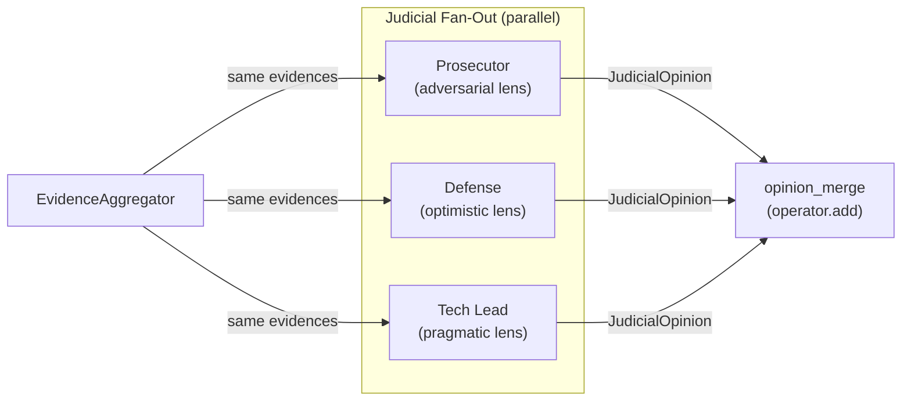

**Retry on structured output failure:**
If `.with_structured_output()` raises a `ValidationError` or returns `None`, the node retries up to 2 times before emitting a fallback `JudicialOpinion(score=1, argument="Parse failure — structured output not returned.", cited_evidence=[])`.

---

### 5.2 Chief Justice Synthesis Engine

**What is missing:** `src/nodes/justice.py` — the `ChiefJusticeNode` that resolves dialectical conflicts into a final `AuditReport`.

**Design (to be implemented):**

The Chief Justice does **not** call an LLM for its core logic. The conflict resolution is deterministic Python:

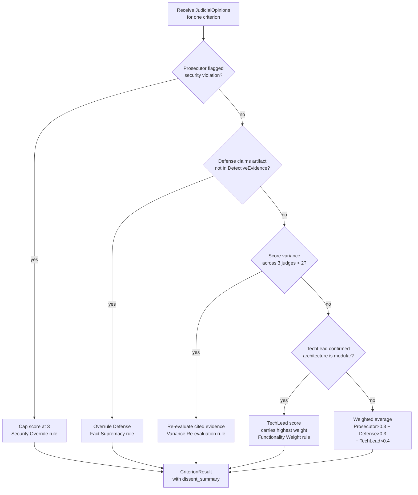

**Dissent requirement:** Any criterion where `max(scores) - min(scores) > 2` must include a `dissent_summary` field in `CriterionResult` explaining which side was overruled and why.

**Output:** The node serialises `AuditReport` to a Markdown file under `audit/report_onself_generated/` or `audit/report_onpeer_generated/` depending on whose repo was audited.

---

### 5.3 Dynamic Rubric Loading

**What is missing:** `rubric.json` and a `ContextBuilder` / `Dispatcher` node that distributes rubric forensic instructions to the correct detective before execution.

**Design (to be implemented):**

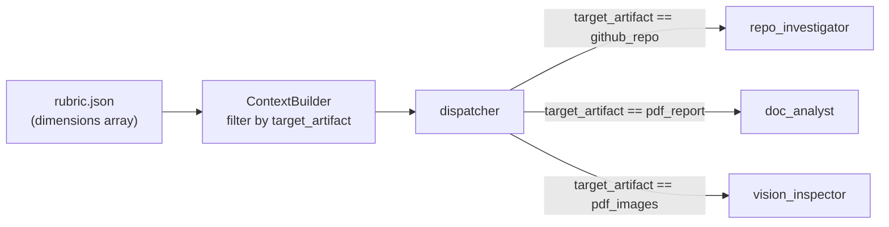

The `rubric.json` is the "Constitution" of the swarm. By separating it from agent code, rubric updates (new dimensions, adjusted weights) can be applied without redeploying the graph. Each detective receives only the `forensic_instruction` fields relevant to its `target_artifact` type.

---

### 5.4 Complete Graph Wiring

The final graph adds the judicial fan-out/fan-in after `EvidenceAggregator` and routes the `ChiefJusticeNode` output to Markdown generation:

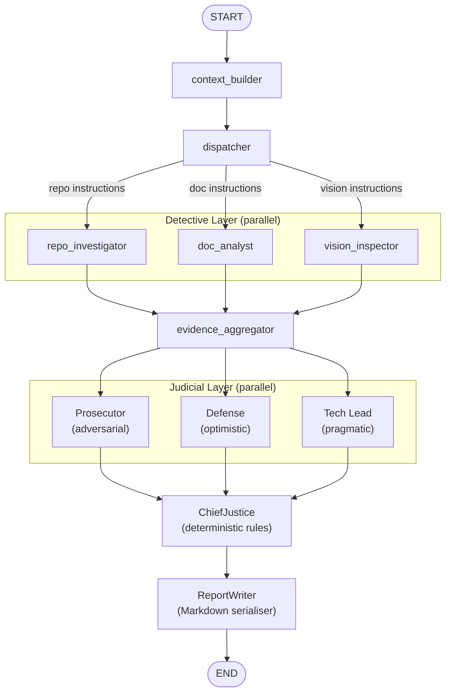

---

## 6. Planned Final Architecture

The full architecture is summarised by this complete state-machine diagram:

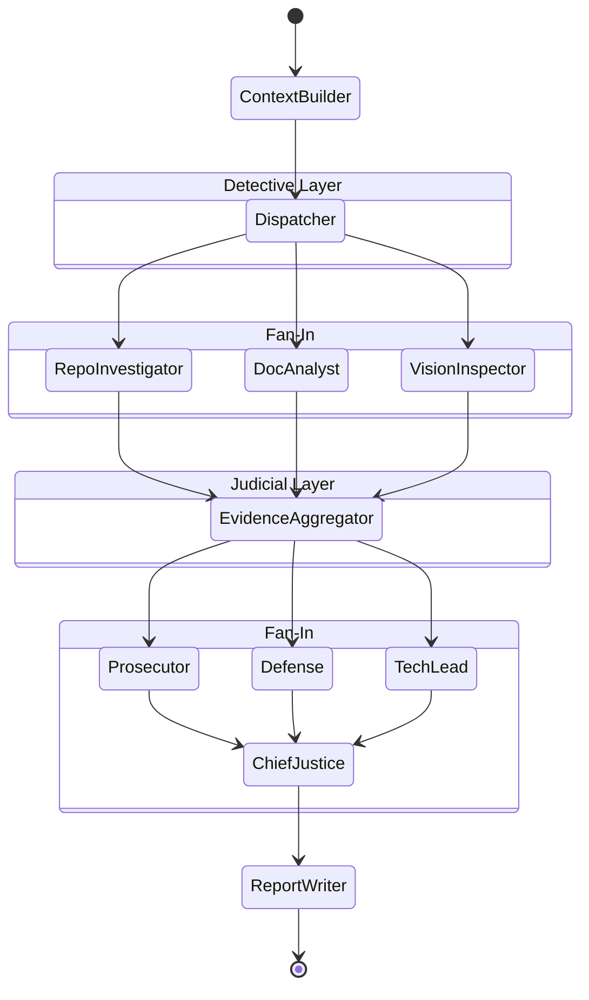

**Key properties of the full system:**

| Property | Implementation |
|---|---|
| Two parallel fan-out/fan-in layers | Detectives + Judges both run in parallel branches |
| Type-safe state throughout | Pydantic `BaseModel` for all value objects |
| No parallel overwrite | `operator.ior` (dicts) and `operator.add` (lists) reducers |
| Deterministic synthesis | Hardcoded Python rules in `ChiefJusticeNode`, not LLM prompts |
| Graceful failure | Every node catches exceptions; emits `found=False` Evidence |
| Structured output enforcement | `.with_structured_output(JudicialOpinion)` on all judge chains |
| Observable | LangSmith tracing via `LANGCHAIN_TRACING_V2=true` |

---

## 7. Environment and Observability

### Environment Variables

| Variable | Purpose | Required |
|---|---|---|
| `LANGCHAIN_TRACING_V2=true` | Enables LangSmith distributed tracing | No |
| `LANGCHAIN_API_KEY` | LangSmith authentication | No |
| `ANTHROPIC_API_KEY` | Claude 3.5 Haiku for VisionInspector diagram analysis | For vision |
| `OPENAI_API_KEY` | GPT-4o-mini fallback for VisionInspector | Alternative |

The `RepoInvestigator` and `DocAnalyst` operate entirely without LLM calls — they are deterministic forensic tools. Only `VisionInspector` requires an API key for diagram classification, and it degrades gracefully to `found=False` when no key is present.

### Observability Architecture

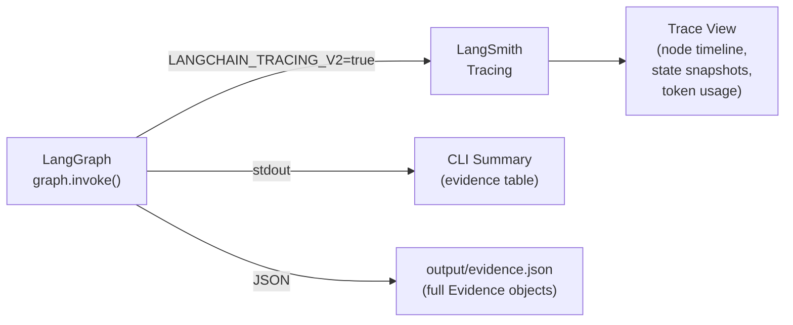

Each node execution is automatically captured as a LangSmith span, showing the input state, output state delta, and latency. This is essential for debugging the parallel fan-out — without it, determining which detective emitted which evidence (or failed silently) requires inspecting raw state diffs.

---

*Automaton Auditor — built with LangGraph, Pydantic v2, PyMuPDF, and uv.*
