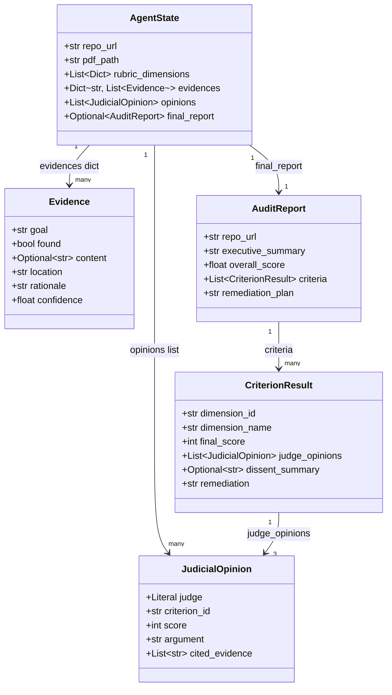
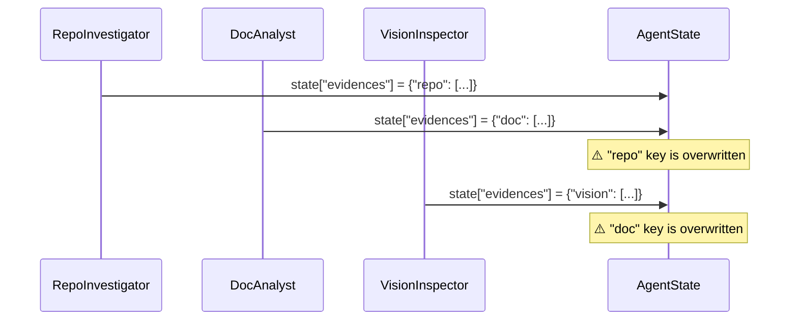
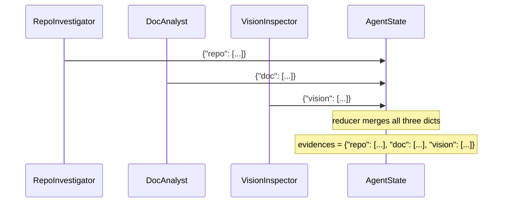
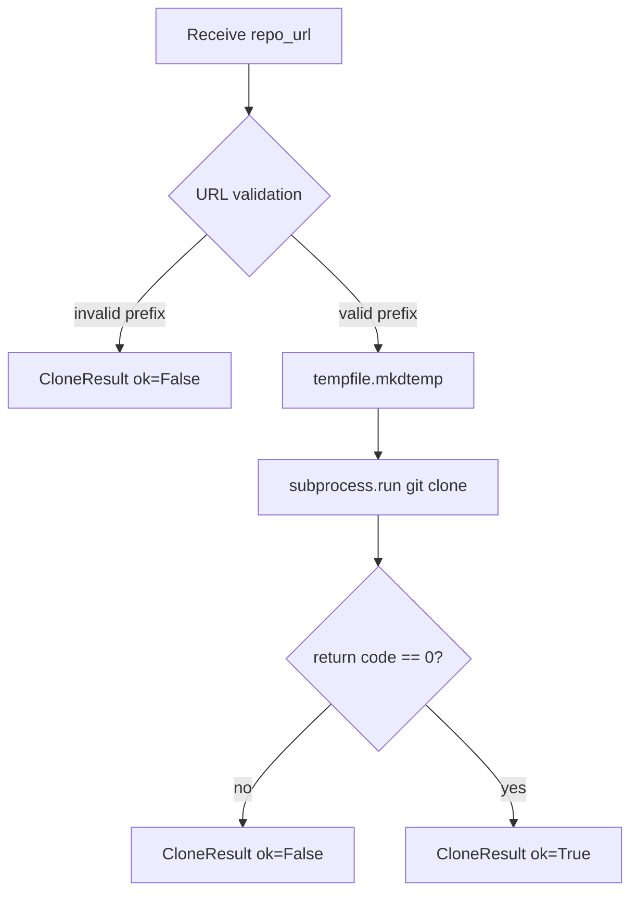
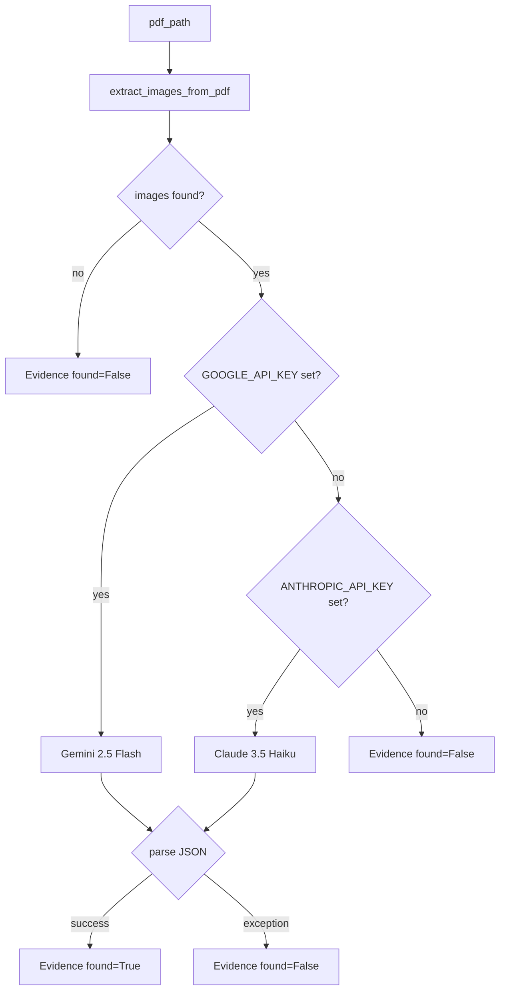
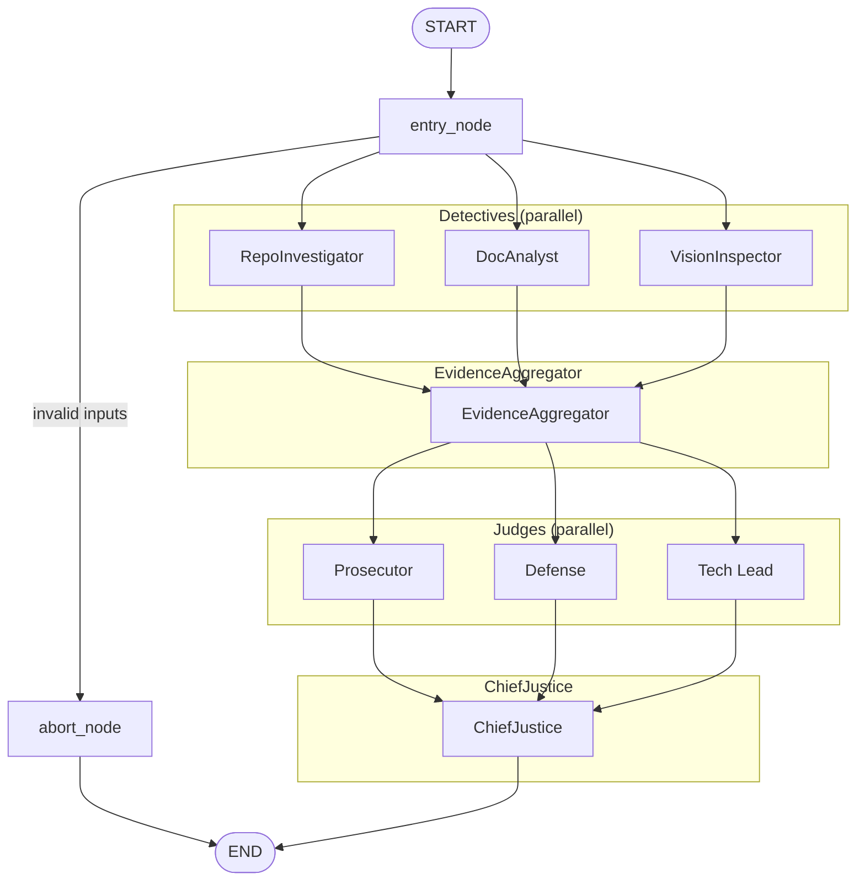
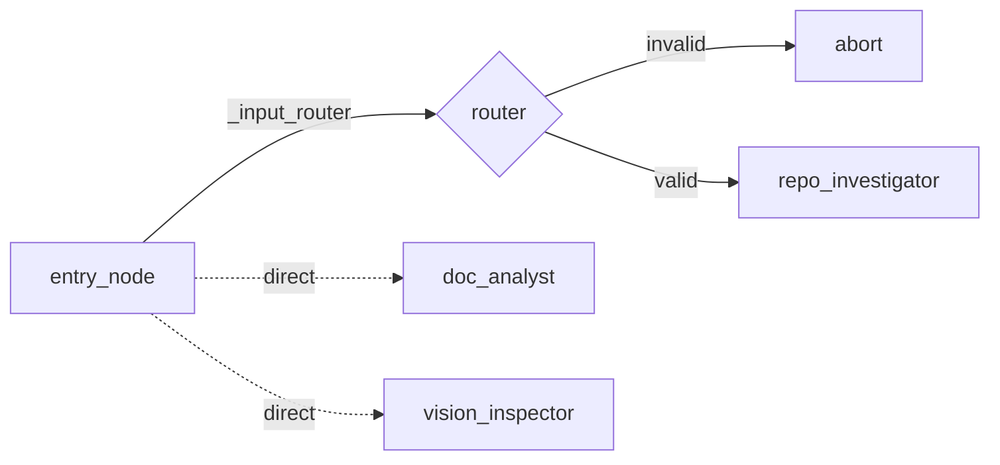
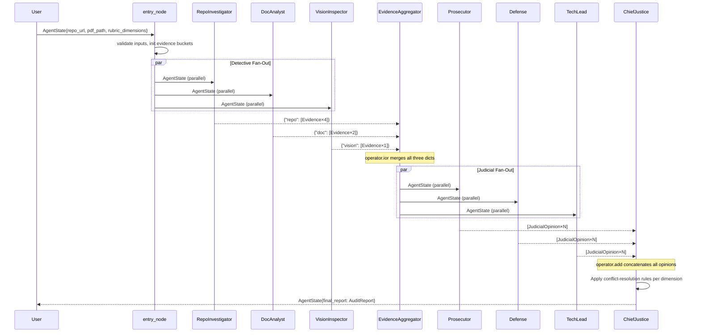
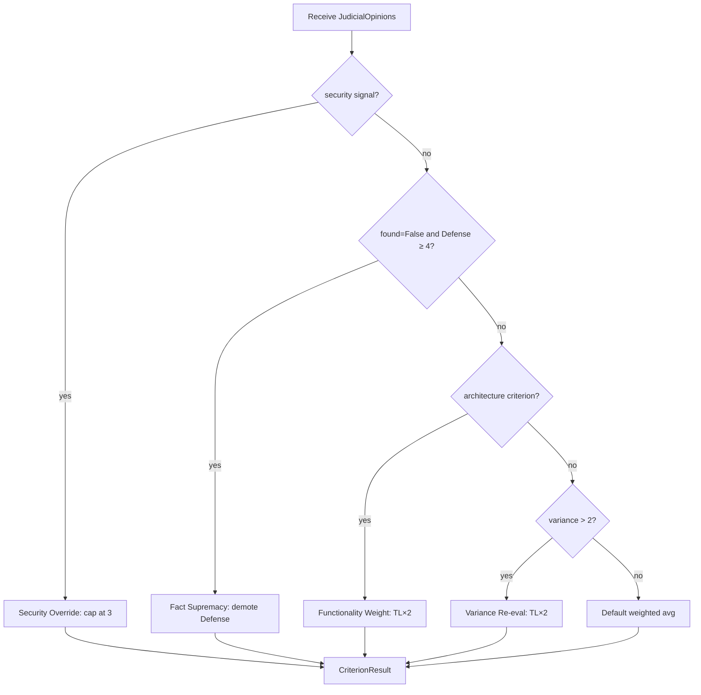
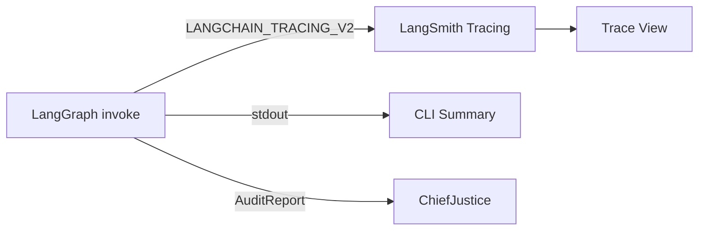

# Automaton Auditor — Final Architecture Report

*Automaton Auditor · Final Submission*

---

## Table of Contents

1. [Project Overview](#1-project-overview)
2. [Architecture Decisions](#2-architecture-decisions)
   - [2.0 Theoretical Framework: Key Concepts and Implementation](#20-theoretical-framework-how-the-architecture-implements-key-concepts)
   - [2.1 Why Pydantic + TypedDict over Plain Dicts](#21-why-pydantic--typeddict-over-plain-dicts)
   - [2.2 State Reducers: Preventing Parallel Overwrites](#22-state-reducers-preventing-parallel-overwrites)
   - [2.3 AST Parsing Strategy](#23-ast-parsing-strategy)
   - [2.4 Sandboxing Strategy for Repository Cloning](#24-sandboxing-strategy-for-repository-cloning)
   - [2.5 PDF Ingestion: RAG-Lite Without a Vector Store](#25-pdf-ingestion-rag-lite-without-a-vector-store)
   - [2.6 Vision Analysis: Graceful Degradation](#26-vision-analysis-graceful-degradation)
   - [2.7 LLM Provider Selection for the Judicial Layer](#27-llm-provider-selection-for-the-judicial-layer)
   - [2.8 Deterministic Chief Justice: No Fourth LLM Call](#28-deterministic-chief-justice-no-fourth-llm-call)
3. [Final StateGraph Flow](#3-final-stategraph-flow)
   - [3.1 Complete Node Topology](#31-complete-node-topology)
   - [3.2 Conditional Edge Logic](#32-conditional-edge-logic)
   - [3.3 Full State Data Flow](#33-full-state-data-flow)
4. [Rubric Dimension Coverage](#4-rubric-dimension-coverage)
5. [Judicial Layer Implementation](#5-judicial-layer-implementation)
   - [5.1 Judge Personas and Structured Output](#51-judge-personas-and-structured-output)
   - [5.2 Chief Justice Conflict-Resolution Rules](#52-chief-justice-conflict-resolution-rules)
   - [5.3 Variance Re-evaluation and Dissent](#53-variance-re-evaluation-and-dissent)
   - [5.4 Metacognitive Evaluation Loop](#54-metacognitive-evaluation-loop)
6. [Implementation Status](#6-implementation-status)
7. [Environment and Observability](#7-environment-and-observability)

---

## 1. Project Overview

The **Automaton Auditor** is a hierarchical multi-agent system built on LangGraph. It accepts a GitHub repository URL and a PDF report as inputs and produces a structured forensic audit across rubric dimensions — verifying code artifacts, architectural patterns, documentation quality, and visual diagrams.

The system is structured as a **Digital Courtroom** with three layers:

- **Detective Layer** — `RepoInvestigator`, `DocAnalyst`, and `VisionInspector` run in parallel, each collecting objective `Evidence` objects tied to specific rubric dimensions.
- **Judicial Layer** — `Prosecutor`, `Defense`, and `Tech Lead` judge nodes run in parallel after evidence aggregation. Each applies a distinct adversarial lens to produce a `JudicialOpinion` per dimension.
- **Supreme Court** — `ChiefJustice` applies deterministic Python conflict-resolution rules to synthesise a final `AuditReport`.

All three layers are fully implemented and wired in the final submission.

---

## 2. Architecture Decisions

### 2.0 Theoretical Framework: How the Architecture Implements Key Concepts

The rubric expects the report to use and explain four concepts in substance, not as buzzwords. This subsection ties each term to the actual implementation.

**Dialectical Synthesis.** The system implements dialectical synthesis (thesis, antithesis, synthesis) via the Judicial Layer. The **Prosecutor** acts as thesis (adversarial, trust-no-one), the **Defense** as antithesis (optimistic, reward effort), and the **Tech Lead** as pragmatic tie-breaker. Synthesis is performed by the **Chief Justice** in `src/nodes/justice.py` using deterministic Python rules — not a fourth LLM — so that conflicting views are resolved by named precedence rules (Security Override, Fact Supremacy, Functionality Weight, Variance Re-evaluation). The three judge personas run in parallel on the same evidence; the Chief Justice then consumes all three `JudicialOpinion` lists and produces one `CriterionResult` per dimension. Thus dialectical synthesis is implemented as: parallel thesis/antithesis (three judges) → single deterministic synthesis (Chief Justice).

**Fan-In / Fan-Out.** The graph has two explicit fan-out/fan-in patterns. *First fan-out:* from `entry_node`, three edges go to `repo_investigator`, `doc_analyst`, and `vision_inspector` (Detective Layer). *First fan-in:* all three detectives feed into `evidence_aggregator`, which merges their `evidences` via the `operator.ior` reducer. *Second fan-out:* from `evidence_aggregator`, three edges go to `prosecutor`, `defense`, and `tech_lead` (Judicial Layer). *Second fan-in:* all three judges feed into `chief_justice`, which receives concatenated `opinions` via the `operator.add` reducer. These edges are defined in `src/graph.py` with `builder.add_edge()` from the same source to multiple targets (fan-out) and from multiple sources to the same target (fan-in).

**State Synchronization.** State is synchronized at two fan-in points. (1) **Evidence aggregation:** `EvidenceAggregator` runs only after all detective nodes have completed. LangGraph’s execution model ensures the node receives the merged state from the reducer; each detective writes into a distinct key (`repo`, `doc`, `vision`), and `operator.ior` merges the three dicts so that the next node sees a single combined `evidences` dict. (2) **Opinion aggregation:** `ChiefJustice` runs only after all three judge nodes have completed. Each judge returns `{"opinions": [JudicialOpinion, ...]}`; `operator.add` concatenates the three lists, so the Chief Justice sees all opinions before applying conflict-resolution rules. There is no hand-written “wait for all” logic — synchronization is enforced by the graph topology and the reducers.

**Metacognition.** The system evaluates its own evaluation quality in several ways. (1) **Variance re-evaluation:** when score variance across the three judges exceeds 2, the Tech Lead’s weight is doubled and a mandatory dissent summary is produced — the system explicitly re-evaluates high-disagreement cases. (2) **Fact supremacy:** the Chief Justice compares judicial claims to detective evidence; if the Defense argues “deep metacognition” but the RepoInvestigator found no supporting artifact (`found=False`), the Defense is overruled — the system checks its own reasoning against collected facts. (3) **Dissent summary:** every high-variance criterion gets a `dissent_summary` in `CriterionResult`, documenting why the Prosecutor and Defense disagreed and how the final score was determined. Together, these mechanisms implement metacognition: the auditor reflects on disagreement and evidence before emitting the final score.

---

### 2.1 Why Pydantic + TypedDict over Plain Dicts

The state management layer uses a hybrid of `TypedDict` (for the graph-level `AgentState`) and Pydantic `BaseModel` (for nested value objects like `Evidence`, `JudicialOpinion`, `CriterionResult`, and `AuditReport`).

**The problem with plain dicts:**

```python
# Fragile: no schema, no validation, silent bugs
state = {"evidences": {"repo": [{"found": True, "confidence": "high"}]}}
```

- Keys can be misspelled silently.
- Values have no type constraints — `confidence: "high"` instead of `0.9` is accepted at runtime.
- Parallel nodes writing to the same key will overwrite each other's data with no indication of failure.
- No `.model_dump()` serialisation for output JSON.

**The chosen approach:**

```python
class Evidence(BaseModel):
    goal: str
    found: bool
    content: Optional[str]
    location: str
    rationale: str
    confidence: float = Field(ge=0.0, le=1.0)
```

Every detective node constructs `Evidence` objects. Pydantic enforces the `ge=0.0, le=1.0` range on `confidence` at instantiation time — not at test time. `JudicialOpinion.score` is similarly constrained to `ge=1, le=5`, making it impossible for a judge to emit a score of `0` or `6` without raising a `ValidationError`.

`AgentState` is a `TypedDict` rather than a Pydantic model because LangGraph's `StateGraph` requires a `TypedDict`-compatible schema for its state channel system.

**Type hierarchy:**



---

### 2.2 State Reducers: Preventing Parallel Overwrites

When three detective nodes run in parallel, each writes into `state["evidences"]`. Without a reducer, the last node to finish silently clobbers the other two nodes' results — a race condition that produces no error and no warning. The same problem occurs with the three judge nodes writing into `state["opinions"]`.

LangGraph resolves this with `Annotated` type hints on the state fields:

```python
class AgentState(TypedDict):
    evidences: Annotated[Dict[str, List[Evidence]], operator.ior]
    opinions: Annotated[List[JudicialOpinion], operator.add]
```

- `operator.ior` (`|=`) performs a **dict merge**: each parallel detective writes into a separate key (`"repo"`, `"doc"`, `"vision"`), and the reducer combines all three dicts without any key colliding.
- `operator.add` performs **list concatenation**: judge opinions from three parallel judge nodes are concatenated into a single list, preserving all opinions for the Chief Justice.

**Without reducer (race condition):**



**With `operator.ior` reducer (correct merge):**



---

### 2.3 AST Parsing Strategy

The `analyze_graph_structure` function in `src/tools/repo_tools.py` uses Python's built-in `ast` module rather than regular expressions.

**Why not regex?**

Regex on source code is brittle. Consider these equivalent constructions:

```python
# Pattern A
builder.add_edge("entry", "repo_investigator")

# Pattern B
g = builder
g.add_edge(
    "entry",
    "repo_investigator"
)

# Pattern C — regex would miss this entirely
edges = [("entry", "repo_investigator")]
for src, dst in edges:
    builder.add_edge(src, dst)
```

A regex pattern for `add_edge\("(\w+)",\s*"(\w+)"\)` matches Pattern A but misses B and C. The AST visitor handles A and B correctly (Pattern C is intentionally out of scope as it requires data-flow analysis).

**AST visitor design:**

```python
class _GraphVisitor(ast.NodeVisitor):
    def visit_Call(self, node: ast.Call):
        func = node.func
        if isinstance(func, ast.Attribute):
            if func.attr == "add_node":       # → collect node name
            if func.attr == "add_edge":       # → collect (src, dst) tuple
            if func.attr == "add_conditional_edges":  # → increment counter
        self.generic_visit(node)
```

The visitor walks the full AST, so it catches nested calls, calls in helper functions, and calls across multiple builder variable names.

**Fan-out and fan-in detection:**

```python
src_counts = Counter(src for src, _ in visitor.edges)
dst_counts = Counter(dst for _, dst in visitor.edges)
has_parallel = any(v >= 2 for v in src_counts.values())   # one src → many dst
has_fan_in   = any(v >= 2 for v in dst_counts.values())   # many src → one dst
```

**Why not `libcst`, `tree-sitter`, or live introspection?**

| Alternative | Rejection reason |
|---|---|
| `libcst` | Preserves whitespace and comments, but adds a third-party dependency and a much larger API surface. The auditor only needs method call names and their string literal arguments — a use case squarely within `ast`'s sweet spot. |
| `tree-sitter` | Language-agnostic and faster on multi-MB files, but requires compiled binary extensions per platform. The auditor's target files are small Python modules; the performance gain does not justify a native extension dependency. |
| `importlib` / live introspection | Importing the target module would **execute the module's top-level code**, including any `StateGraph.compile()` calls. Executing untrusted code from an unknown repository is the exact threat model the sandboxing strategy (§2.4) was designed to avoid. |

---

### 2.4 Sandboxing Strategy for Repository Cloning

Cloning unknown repositories is a high-risk operation. The `clone_repo_sandboxed` function in `src/tools/repo_tools.py` applies four layers of protection:



**Layer 1 — URL allow-listing:**
Only `https://` and `git@` prefixes are accepted. Any other value returns an error before any subprocess is spawned. This prevents injection strings like `; rm -rf /` embedded in a URL.

**Layer 2 — Temp directory isolation:**
`tempfile.mkdtemp()` creates a directory with a randomised name under the OS's temp path. The cloned repository never touches the working directory of the auditor process.

**Layer 3 — `subprocess.run` with an explicit argument list (no `shell=True`):**
When `shell=True` is used, the command string is passed to `/bin/sh -c`, which means shell metacharacters in `repo_url` are interpreted. An explicit argument list bypasses the shell entirely:

```python
# Vulnerable — shell interprets metacharacters in repo_url
subprocess.run(f"git clone {repo_url} {tmp}", shell=True)

# Safe — repo_url is passed as a literal argument to git
subprocess.run(["git", "clone", repo_url, tmp], capture_output=True)
```

**Layer 4 — Return-code checking and structured errors:**
`returncode != 0` is always checked. `stderr` is captured and returned inside `CloneResult.details`. No exception propagates to the graph.

---

### 2.5 PDF Ingestion: RAG-Lite Without a Vector Store

The `ingest_pdf` function uses PyMuPDF (`fitz`) to extract text page-by-page, then splits it into overlapping character-window chunks (~1800 characters, ~75% overlap between consecutive chunks).

**Why chunking instead of full-document context?**

LLM context windows are finite. A 30-page PDF with diagrams can exceed 40,000 tokens. Chunking allows targeted retrieval: instead of passing the entire PDF to an LLM, the `query_pdf` function uses a TF-score (term frequency) ranking to surface the top-k most relevant chunks for a given query.

**TF scoring (no external vector DB required):**

```python
def _tf_score(query_tokens, doc_tokens):
    score = sum(doc_tokens.count(qt) / len(doc_tokens) for qt in query_tokens)
    return score * math.log(1 + len(doc_tokens))
```

The log factor discounts extremely long chunks that would otherwise always win by sheer volume.

**Why PyMuPDF (`fitz`) over other PDF parsers?**

| Library | Verdict |
|---|---|
| `pdfplumber` | Excellent for table extraction, but 3–5× slower than PyMuPDF for raw text extraction. Overkill for sequential plain text. |
| `pdfminer.six` | Low-level and configurable, but requires manual layout analysis object management. Additional complexity not justified. |
| `pypdf` | Lightweight and zero C-extension, but loses text ordering on multi-column PDFs with embedded fonts. |
| `PyMuPDF` (`fitz`) | Native C extension (libmupdf), fastest raw text extraction in benchmarks, robust on embedded fonts, and provides `page.get_images()` for diagram PNGs. A single library for both text (DocAnalyst) and images (VisionInspector) avoids loading the file twice. |

---

### 2.6 Vision Analysis: Graceful Degradation

`VisionInspector` is designed so that the absence of a vision-capable API key never crashes the graph. The execution path degrades gracefully at each step:



The five classification labels are aligned with the rubric's `swarm_visual` dimension:

| Label | Meaning |
|---|---|
| `accurate_stategraph` | Shows parallel fan-out/fan-in LangGraph nodes |
| `sequence_diagram` | UML sequence / step arrows |
| `generic_flowchart` | Flowchart without parallelism |
| `linear_pipeline` | Strictly sequential, no parallelism |
| `other` | Unclassifiable |

---

### 2.7 LLM Provider Selection for the Judicial Layer

The Judicial Layer uses LLMs to generate structured `JudicialOpinion` objects. Provider selection was driven by **access constraints and task-fit** at the time of project undertaking, not abstract benchmark comparisons.

**Primary constraint: existing subscription access**

An active Anthropic subscription was already in place at project start. This made Claude the zero-friction choice for all text reasoning tasks — no new billing setup, no quota approval wait, and predictable pricing already understood from prior use.

**Model tier: Haiku for judges**

The three judge personas (`Prosecutor`, `Defense`, `Tech Lead`) are implemented against `ChatAnthropic` with `claude-haiku-4-5-20251001`. Haiku was chosen over Sonnet after weighing cost against the structured output constraint: the `JudicialOpinion` schema requires a `cited_evidence: List[str]` field with actual dimension IDs. Haiku's structured output adherence was sufficient for this bounded task — it receives explicit instructions listing all required fields, and the retry loop (up to 3 attempts) catches any validation failures before falling back to a score-1 opinion.

**API key dependency summary:**

| Use case | Primary | Fallback | Behaviour with no key |
|---|---|---|---|
| Judge personas (all three) | `ANTHROPIC_API_KEY` (Claude Haiku 4-5) | None | Node emits fallback `JudicialOpinion(score=1, argument="Opinion emission failed...")` |
| Vision diagram analysis | `GOOGLE_API_KEY` (Gemini 2.5 Flash) | `ANTHROPIC_API_KEY` (Claude Haiku) | `Evidence(found=False, rationale="No vision model configured")` |

---

### 2.8 Deterministic Chief Justice: No Fourth LLM Call

The obvious synthesis alternative — passing all three `JudicialOpinion` objects to an LLM and asking it to produce a final score — was rejected for three reasons:

1. **Non-determinism.** Two consecutive runs on identical evidence can yield different final scores when synthesis is LLM-driven. An auditing system that produces different verdicts on the same input is not auditable. The hardcoded Python rules produce the same `CriterionResult` for the same inputs every time.

2. **Accountability.** If a score is disputed, "the LLM decided" is not an answer. The deterministic rules (`Security Override`, `Fact Supremacy`, `Variance Re-evaluation`, `Functionality Weight`) are named, version-controlled, and readable directly. The audit trail is the code itself.

3. **Cost and latency.** The Judicial Layer already makes LLM calls in parallel for three judges across all rubric dimensions. Adding a fourth synthesis call per dimension would roughly double the token spend with no accuracy benefit — conflict resolution is precedence application, not creative reasoning.

The LLM is reserved for tasks that require language understanding (interpreting evidence, constructing arguments). Arithmetic precedence rules belong in Python.

---

## 3. Final StateGraph Flow

### 3.1 Complete Node Topology

The final graph implements all three layers: Detective, Judicial, and Supreme Court (Chief Justice). The diagram below is a **LangGraph StateGraph** view. **Fan-out** (one node → multiple nodes in parallel) and **fan-in** (multiple nodes → one synchronisation node) are explicitly labelled so the parallelism is unambiguous. This matches the structure in `src/graph.py`: `entry_node` fans out to three detectives; they fan in to `evidence_aggregator`; the aggregator fans out to three judges; they fan in to `chief_justice`.



**Diagram conventions:** Subgraphs **Detectives (parallel)** and **Judges (parallel)** run concurrently. **EvidenceAggregator** and **ChiefJustice** run only after all incoming branches complete. Flow: START → entry_node → **[RepoInvestigator ∥ DocAnalyst ∥ VisionInspector]** → EvidenceAggregator → **[Prosecutor ∥ Defense ∥ TechLead]** → ChiefJustice → END.

### 3.2 Conditional Edge Logic

The `entry_node` validates inputs before the detective fan-out:



`doc_analyst` and `vision_inspector` receive direct (non-conditional) edges from `entry_node` because they are independent of URL validity — they only require `pdf_path`. The conditional router gates only `RepoInvestigator`. Diagram labels: *valid* = https:// or git@ URL with pdf_path; *invalid* = missing inputs or bad URL prefix.

### 3.3 Full State Data Flow



---

## 4. Rubric Dimension Coverage

The table below maps each rubric dimension to the detective node that collects evidence, and to the judge personas that evaluate it:

| Dimension | Detective | Tool Function | Confidence Heuristic |
|---|---|---|---|
| `git_forensic_analysis` | RepoInvestigator | `extract_git_history` | 0.85 if ≥2 phases detected in commit messages; 0.4 otherwise |
| `state_management_rigor` | RepoInvestigator | AST scan of `src/state.py` | 0.9 if Pydantic + TypedDict + reducers all present; 0.5 otherwise |
| `graph_orchestration` | RepoInvestigator | `analyze_graph_structure` | 0.9 if fan-out AND fan-in detected; 0.5 otherwise |
| `safe_tool_engineering` | RepoInvestigator | `clone_repo_sandboxed` (self-audit) | 0.95 (constant — deterministic check) |
| `theoretical_depth` | DocAnalyst | `query_pdf` × 6 rubric queries | `matched_count / total_queries` |
| `report_accuracy` | DocAnalyst | `extract_file_paths_from_text` + path existence check | `verified_count / mentioned_count` |
| `swarm_visual` | VisionInspector | `extract_images_from_pdf` + `analyze_diagram` | LLM-reported confidence × 0.5 if not `accurate_stategraph` |

All seven dimensions are evaluated by all three judge personas (`Prosecutor`, `Defense`, `Tech Lead`) and synthesised by `ChiefJustice` into a single `CriterionResult` per dimension.

---

## 5. Judicial Layer Implementation

### 5.1 Judge Personas and Structured Output

Three judge node functions run in parallel after `EvidenceAggregator`: `prosecutor_node`, `defense_node`, and `tech_lead_node`. Each is a LangGraph node function implemented in `src/nodes/judges.py`.

All three share the same `_judge_node` factory, which:

1. Iterates over every rubric dimension in `state["rubric_dimensions"]`.
2. Looks up the corresponding `Evidence` object from `state["evidences"]` using `ev.goal == dim_id`.
3. Calls the judge LLM bound to `JudicialOpinion` via `.with_structured_output(JudicialOpinion)`.
4. Retries up to `MAX_RETRIES=3` on `ValidationError` or any exception.
5. Falls back to `JudicialOpinion(score=1, argument="Opinion emission failed...")` on total failure.

**Persona mandates:**

| Persona | Core mandate | Scoring bias |
|---|---|---|
| Prosecutor | "Trust No One. Assume Vibe Coding." | Score 1–2 for violations; penalises gaps, security flaws, laziness |
| Defense | "Reward Effort and Intent." | Score 3–5; credits iteration, architectural understanding, creative workarounds |
| Tech Lead | "Evaluate architectural soundness only." | Scores **1, 3, or 5 only** (never 2 or 4); acts as tie-breaker |

The Tech Lead's restriction to odd scores (1, 3, 5) is an explicit scoring anchor that prevents hedging — the persona must commit to a clear verdict rather than splitting the difference between Prosecutor and Defense.

**Structured output binding:**

```python
llm = ChatAnthropic(model=_MODEL, temperature=0)
judge_llm = llm.with_structured_output(JudicialOpinion)
```

`temperature=0` is set on all judge chains to maximise schema adherence and reduce the probability of freeform text responses that would trigger retries.

**Parallel accumulation via `operator.add`:**

Because `AgentState.opinions` is annotated with `operator.add`, the three judge nodes each return `{"opinions": [JudicialOpinion, ...]}` and LangGraph concatenates all three lists before passing them to `chief_justice`. No opinion is overwritten.

### 5.2 Chief Justice Conflict-Resolution Rules

The `ChiefJusticeNode` in `src/nodes/justice.py` is a pure Python function — no LLM call. It groups all opinions by `criterion_id` and applies five named rules in priority order:



**Rule 1 — Security Override:**
The Prosecutor's argument is scanned for keyword signals (`"os.system"`, `"security negligence"`, `"shell injection"`, `"unsanitized"`, `"no sandbox"`). When a confirmed security flaw is detected, the final score is capped at 3 regardless of other judges' positions.

**Rule 2 — Fact Supremacy:**
When the detective found the artifact missing (`found=False`) but the Defense assigned score ≥ 4 (excessive generosity), the Defense score is demoted by 2 and the final score is computed as the minimum of the demoted Defense score and the Tech Lead score — grounded in what actually exists in the repository.

**Rule 3 — Functionality Weight:**
For architecture-critical dimensions (`graph_orchestration`, `state_management_rigor`, `safe_tool_engineering`, `chief_justice_synthesis`), the Tech Lead's score carries double weight in the weighted average. The Tech Lead is the most qualified judge for correctness questions.

**Rule 4 — Variance Re-evaluation:**
When `max(scores) − min(scores) > 2` across the three judges, the panel is significantly divided. The Tech Lead's weight is doubled to break the deadlock with a pragmatic anchor, before the mandatory dissent summary is generated.

**Rule 5 — Default weighted average:**
All three judges contribute equal weight. `round()` is used for integer conversion (Python's banker's rounding).

### 5.3 Variance Re-evaluation and Dissent

Any criterion where score variance exceeds 2 receives a mandatory `dissent_summary` field in `CriterionResult`. The summary identifies which judge argued for which score, and documents which side the Tech Lead's tie-breaker weight resolved toward.

**Weighted score computation:**

```python
def _weighted_score(prosecutor, defense, tech_lead, tl_weight=1) -> int:
    total_weight = 0
    total_score = 0

    if prosecutor:
        total_score += prosecutor.score * 1
        total_weight += 1
    if defense:
        total_score += defense.score * 1
        total_weight += 1
    if tech_lead:
        total_score += tech_lead.score * tl_weight
        total_weight += tl_weight

    raw = round(total_score / total_weight)
    return max(1, min(5, raw))
```

The `tl_weight` parameter is set to `2` for architecture criteria (Rule 3) and high-variance cases (Rule 4), and to `1` for the default path.

---

## 5.4 Metacognitive Evaluation Loop

Metacognition — the system's ability to evaluate the quality of its own evaluation — is implemented across three distinct mechanisms in the Automaton Auditor. Unlike systems that blindly emit a score from a single LLM call, this auditor reflects on disagreement, challenges its own intermediate conclusions against collected facts, and documents its reasoning chain before finalising any verdict.

### Confidence Score as an Evaluation Quality Signal

Every `Evidence` object produced by the detective layer carries a `confidence` field (`float`, `ge=0.0`, `le=1.0`, defined in `src/state.py`). This field is not a self-reported LLM claim — it is a deterministically computed heuristic based on measurable artifact properties:

- **`git_forensic_analysis`**: confidence = 0.85 when ≥ 2 development phases are detected in commit messages; 0.4 otherwise (`src/nodes/detectives.py`, `extract_git_history` heuristic).
- **`state_management_rigor`**: confidence = 0.9 when Pydantic + TypedDict + reducer patterns are all confirmed present via AST scan; 0.5 when only partial matches are found.
- **`graph_orchestration`**: confidence = 0.9 when both `has_parallel_branches=True` and `has_fan_in=True` are confirmed; 0.5 otherwise.
- **`report_accuracy`**: confidence = `verified_paths / total_mentioned_paths` — the ratio of file paths in the PDF that actually exist in the repository.
- **`swarm_visual`**: confidence = `llm_reported_confidence × 0.5` when the diagram is not classified as `accurate_stategraph`; the penalty signals low-quality visual evidence.

These confidence values flow into every judge's `DETECTIVE EVIDENCE` payload (formatted in `src/nodes/judges.py`, `_invoke_judge`). A judge receiving `confidence=0.15` for a dimension knows the detective was uncertain; a judge receiving `confidence=0.98` knows the forensic evidence is conclusive. The three judges therefore calibrate their arguments against the evidence quality signal, not just the evidence content.

### Score Variance as a Contradiction Detector

The Chief Justice (`src/nodes/justice.py`) implements an explicit contradiction-detection step before finalising every criterion score. After collecting all three `JudicialOpinion` objects for a dimension, it computes:

```python
var = max(scores) - min(scores)
if var > 2:
    # High disagreement — the panel is significantly divided.
    # Re-evaluate: double Tech Lead weight as pragmatic anchor.
    return _weighted_score(prosecutor, defense, tech_lead, tl_weight=2)
```

A variance greater than 2 means the Prosecutor and Defense differ by at least 3 score points — a signal that the panel holds irreconcilable views. The system responds by automatically shifting weight toward the Tech Lead, who scores only 1, 3, or 5 (never hedging at 2 or 4), providing a decisive architectural anchor. This is variance re-evaluation: the system detects its own internal disagreement and adjusts the synthesis mechanism before emitting the final score.

Every high-variance criterion also receives a mandatory `dissent_summary` (generated in `_dissent_summary()`, `src/nodes/justice.py`), which is preserved in the `CriterionResult` and surfaced in the Markdown report. This dissent log serves as a metacognitive audit trail: a reader can inspect exactly which judge held which position, and how the tie-breaker resolved it.

### Fact Supremacy as a Self-Correction Mechanism

The most direct form of metacognition in this system is `apply_rule_of_evidence()` in `src/nodes/justice.py`. This function compares the Defense attorney's judicial claim against the detective's raw forensic finding:

```python
detective_found = _evidence_found(dim_id, evidences)
if detective_found is False and defense and defense.score >= 4:
    # Defense is generous but the artifact does not exist.
    # The system overrules its own optimistic judge.
    adjusted_defense = max(defense.score - 2, 1)
    return max(min(tl_score, adjusted_defense), prosecutor.score)
```

When the Defense argues for a high score (≥ 4) but the detective confirmed the artifact is missing (`found=False`), the system overrules its own judge. This is a direct feedback loop: the judicial layer checks its conclusions against the detective layer's ground truth, and corrects any opinion that contradicts the collected evidence. The system does not accept its own intermediate reasoning uncritically — it validates claims against artifacts before committing to a final score.

Together, these three mechanisms — confidence-calibrated evidence, variance-triggered re-evaluation, and fact-supremacy correction — constitute a genuine metacognitive loop: the auditor reflects on the quality of its reasoning at each synthesis step and adjusts before emitting a final verdict.

---

## 6. Implementation Status

All components described in the interim submission's "Known Gaps" section are now implemented.

| Component | File | Status |
|---|---|---|
| `JudicialOpinion` schema with `security_flagged` semantics | `src/state.py` | ✓ Implemented — security signalling via keyword scan in `_has_security_flaw()` |
| `prosecutor_node` (adversarial judge) | `src/nodes/judges.py` | ✓ Implemented — parallel LangGraph node with structured output and retry |
| `defense_node` (optimistic judge) | `src/nodes/judges.py` | ✓ Implemented — parallel LangGraph node with structured output and retry |
| `tech_lead_node` (pragmatic tie-breaker, scores 1/3/5 only) | `src/nodes/judges.py` | ✓ Implemented — parallel LangGraph node with structured output and retry |
| `chief_justice_node` (deterministic Python synthesis) | `src/nodes/justice.py` | ✓ Implemented — five named rules, no LLM call |
| `audit_report_to_markdown()` serialiser | `src/utils/report_writer.py` | ✓ Implemented — structured Markdown output from `AuditReport` |
| Full graph wiring (detective + judicial fan-out/fan-in) | `src/graph.py` | ✓ Implemented — `evidence_aggregator → [prosecutor, defense, tech_lead] → chief_justice → END` |

**Remaining known limitations:**

- **Dynamic rubric routing in judges:** All judge nodes currently iterate over `state["rubric_dimensions"]` and produce one opinion per dimension. A future enhancement would match each dimension to its canonical detective bucket before routing, giving judges explicit context about whether the evidence came from a repo scan, PDF analysis, or vision analysis.
- **Incremental evidence persistence:** Evidence is written only at run completion. If the process crashes mid-run, evidence collected so far is lost unless the run is resumed with the same `--thread-id` (LangGraph checkpointing is wired in `main.py`).

---

## 7. Environment and Observability

### Environment Variables

| Variable | Purpose | Required |
|---|---|---|
| `LANGCHAIN_TRACING_V2=true` | Enables LangSmith distributed tracing | No |
| `LANGCHAIN_API_KEY` | LangSmith authentication | No |
| `ANTHROPIC_API_KEY` | Claude Haiku for all three judge personas; Claude Haiku as vision fallback | For judges |
| `GOOGLE_API_KEY` | Gemini 2.5 Flash for VisionInspector diagram analysis | For vision |

`RepoInvestigator` and `DocAnalyst` operate entirely without LLM calls — they are deterministic forensic tools. `VisionInspector` requires `GOOGLE_API_KEY` for primary diagram classification and falls back to `ANTHROPIC_API_KEY` (Haiku) if unavailable. The Judicial Layer requires `ANTHROPIC_API_KEY` for all three judge personas; without it, each judge emits a score-1 fallback opinion.

### Observability Architecture



Each node execution is automatically captured as a LangSmith span, showing the input state, output state delta, and latency. This is essential for debugging the parallel fan-outs — without it, determining which detective or judge emitted which output (or failed silently) requires inspecting raw state diffs.

The two-layer parallel topology (detective fan-out + judicial fan-out) produces a characteristic LangSmith trace shape: two "width" spikes separated by the `EvidenceAggregator` node, with the `ChiefJustice` node appearing as a single leaf after the second fan-in.

---

*Automaton Auditor — built with LangGraph, Pydantic v2, PyMuPDF, and uv.*
