# Automaton Auditor — Interim Architecture Report

*Automaton Auditor · Interim Submission*

---

## Table of Contents

1. [Project Overview](#1-project-overview)
2. [Architecture Decisions](#2-architecture-decisions)
   - [2.1 Why Pydantic + TypedDict over Plain Dicts](#21-why-pydantic--typeddict-over-plain-dicts)
   - [2.2 State Reducers: Preventing Parallel Overwrites](#22-state-reducers-preventing-parallel-overwrites)
   - [2.3 AST Parsing Strategy](#23-ast-parsing-strategy)
   - [2.4 Sandboxing Strategy for Repository Cloning](#24-sandboxing-strategy-for-repository-cloning)
   - [2.5 PDF Ingestion: RAG-Lite Without a Vector Store](#25-pdf-ingestion-rag-lite-without-a-vector-store)
   - [2.6 Vision Analysis: Graceful Degradation](#26-vision-analysis-graceful-degradation)
   - [2.7 LLM Provider Selection for the Judicial Layer](#27-llm-provider-selection-for-the-judicial-layer)
3. [Interim StateGraph Flow](#3-interim-stategraph-flow)
   - [3.1 Node Topology](#31-node-topology)
   - [3.2 Conditional Edge Logic](#32-conditional-edge-logic)
   - [3.3 State Data Flow](#33-state-data-flow)
4. [Rubric Dimension Coverage](#4-rubric-dimension-coverage)
5. [Known Gaps and Plan for Final Submission](#5-known-gaps-and-plan-for-final-submission)
   - [5.1 Judicial Layer](#51-judicial-layer)
   - [5.2 Chief Justice Synthesis Engine](#52-chief-justice-synthesis-engine)
   - [5.3 Dynamic Rubric Loading](#53-dynamic-rubric-loading)
   - [5.4 Implementation Sequence](#54-implementation-sequence)
   - [5.5 Complete Graph Wiring](#55-complete-graph-wiring)
6. [Planned Final Architecture](#6-planned-final-architecture)
7. [Environment and Observability](#7-environment-and-observability)

---

## 1. Project Overview

The **Automaton Auditor** is a hierarchical multi-agent system built on LangGraph. It accepts a GitHub repository URL and a PDF report as inputs and produces structured forensic evidence across rubric dimensions — verifying code artifacts, architectural patterns, documentation quality, and visual diagrams.

The system is structured as a **Digital Courtroom**: detective agents collect objective evidence, judicial agents apply competing interpretive lenses to that evidence, and a Chief Justice synthesizes a final, deterministic verdict.

This document covers the interim state of the system, corresponding to the Detective Layer (Layer 1) only. The Judicial Layer (Layer 2) and Supreme Court (Layer 3) are designed and planned but not yet implemented.

---

## 2. Architecture Decisions

### 2.1 Why Pydantic + TypedDict over Plain Dicts

The state management layer uses a hybrid of `TypedDict` (for the graph-level `AgentState`) and Pydantic `BaseModel` (for nested value objects like `Evidence`, `JudicialOpinion`, `CriterionResult`, and `AuditReport`).

**The problem with plain dicts:**

```python
# Fragile: no schema, no validation, silent bugs
state = {"evidences": {"repo": [{"found": True, "confidence": "high"}]}}
```

- Keys can be misspelled silently.
- Values have no type constraints — `confidence: "high"` instead of `0.9` is accepted at runtime.
- Parallel nodes writing to the same key will overwrite each other's data with no indication of failure.
- No `.model_dump()` serialisation for output JSON.

**The chosen approach:**

```python
class Evidence(BaseModel):
    goal: str
    found: bool
    content: Optional[str]
    location: str
    rationale: str
    confidence: float = Field(ge=0.0, le=1.0)
```

Every detective node constructs `Evidence` objects. Pydantic enforces the `ge=0.0, le=1.0` range on `confidence` at instantiation time — not at test time. `JudicialOpinion.score` is similarly constrained to `ge=1, le=5`, making it impossible for a judge to emit a score of `0` or `6` without raising a `ValidationError`.

`AgentState` is a `TypedDict` rather than a Pydantic model because LangGraph's `StateGraph` requires a `TypedDict`-compatible schema for its state channel system.

**Type hierarchy:**

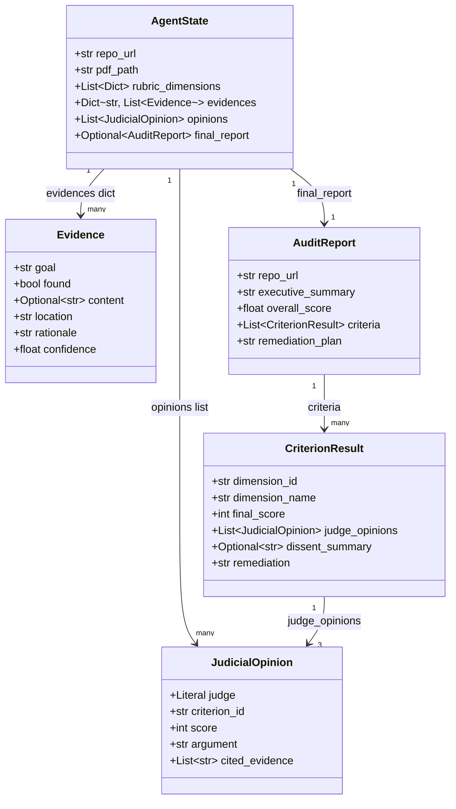

---

### 2.2 State Reducers: Preventing Parallel Overwrites

When three detective nodes run in parallel, each writes into `state["evidences"]`. Without a reducer, the last node to finish silently clobbers the other two nodes' results — a race condition that produces no error and no warning.

LangGraph resolves this with `Annotated` type hints on the state fields:

```python
class AgentState(TypedDict):
    evidences: Annotated[Dict[str, List[Evidence]], operator.ior]
    opinions: Annotated[List[JudicialOpinion], operator.add]
```

- `operator.ior` (`|=`) performs a **dict merge**: each parallel node writes into a separate key (`"repo"`, `"doc"`, `"vision"`), and the reducer combines all three dicts without any key colliding.
- `operator.add` performs **list concatenation**: judge opinions from three parallel judge nodes are concatenated into a single list.

**Without reducer (race condition):**

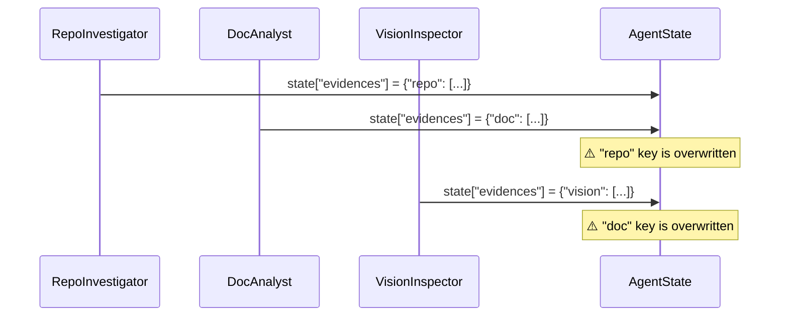

**With `operator.ior` reducer (correct merge):**

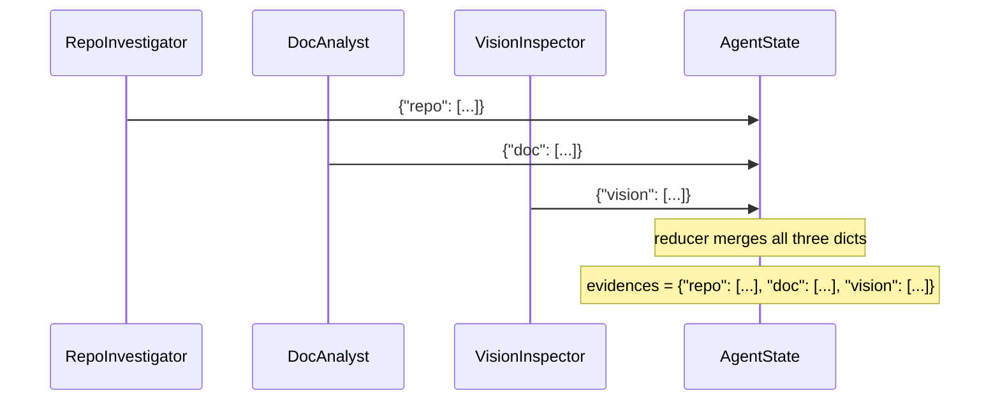

---

### 2.3 AST Parsing Strategy

The `analyze_graph_structure` function in `src/tools/repo_tools.py` uses Python's built-in `ast` module rather than regular expressions.

**Why not regex?**

Regex on source code is brittle. Consider these equivalent constructions:

```python
# Pattern A
builder.add_edge("entry", "repo_investigator")

# Pattern B
g = builder
g.add_edge(
    "entry",
    "repo_investigator"
)

# Pattern C — regex would miss this entirely
edges = [("entry", "repo_investigator")]
for src, dst in edges:
    builder.add_edge(src, dst)
```

A regex pattern for `add_edge\("(\w+)",\s*"(\w+)"\)` matches Pattern A but misses B and C. The AST visitor handles A and B correctly (Pattern C is intentionally out of scope as it requires data-flow analysis).

**AST visitor design:**

```python
class _GraphVisitor(ast.NodeVisitor):
    def visit_Call(self, node: ast.Call):
        func = node.func
        if isinstance(func, ast.Attribute):
            if func.attr == "add_node":       # → collect node name
            if func.attr == "add_edge":       # → collect (src, dst) tuple
            if func.attr == "add_conditional_edges":  # → increment counter
        self.generic_visit(node)
```

The visitor walks the full AST, so it catches nested calls, calls in helper functions, and calls across multiple builder variable names. The only hard requirement is that the string literal appears directly as the first argument (constant folding is not implemented — that covers the majority of LangGraph code patterns in practice).

**Error handling:**

- `SyntaxError` on `ast.parse()` → returns `GraphAnalysisResult(ok=False, error="parse_error: ...")`
- File not found → returns `ok=False, error="file_not_found"`
- `StateGraph` not found in AST → returns `ok=False, error="no_stategraph_found"`

None of these raise exceptions into the graph; the detective node catches them and emits `Evidence(found=False, ...)`.

**Fan-out and fan-in detection:**

```python
src_counts = Counter(src for src, _ in visitor.edges)
dst_counts = Counter(dst for _, dst in visitor.edges)
has_parallel = any(v >= 2 for v in src_counts.values())   # one src → many dst
has_fan_in   = any(v >= 2 for v in dst_counts.values())   # many src → one dst
```

**Why not `libcst`, `tree-sitter`, or live introspection?**

Three alternatives were considered and rejected:

| Alternative | Rejection reason |
|---|---|
| `libcst` (Concrete Syntax Tree) | Preserves whitespace and comments, but adds a third-party dependency and an order-of-magnitude more API surface. The auditor only needs to detect method call names and their string literal arguments — a use case that falls squarely within the stdlib `ast` module's sweet spot. |
| `tree-sitter` | Language-agnostic and faster on multi-MB files, but requires compiled binary extensions per platform. The auditor's target files are small Python modules; the performance gain does not justify adding a native extension to the dependency graph. |
| `importlib` / live graph introspection | Importing the target module would **execute the module's top-level code**, including any `StateGraph.compile()` and node registration calls. Executing untrusted code from an unknown repository is the exact threat model the sandboxing strategy (§2.4) was designed to avoid. Static analysis via `ast` is safe precisely because it never runs the code. |

The stdlib `ast` module is zero-dependency, ships with every CPython installation, and handles the full range of method-call patterns present in typical LangGraph graphs. Its one genuine limitation — inability to resolve aliased builder variables across function boundaries — is documented as an accepted scope boundary, not a silent failure.

---

### 2.4 Sandboxing Strategy for Repository Cloning

Cloning unknown repositories is a high-risk operation. The `clone_repo_sandboxed` function in `src/tools/repo_tools.py` applies four layers of protection:

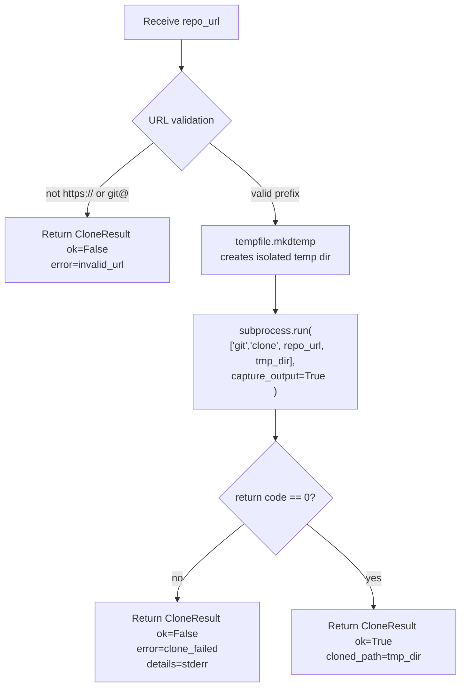

**Layer 1 — URL allow-listing:**
Only `https://` and `git@` prefixes are accepted. Any other value returns an error before any subprocess is spawned. This prevents injection strings like `; rm -rf /` embedded in a URL.

**Layer 2 — Temp directory isolation:**
`tempfile.mkdtemp()` creates a directory with a randomised name under the OS's temp path (e.g., `/tmp/auditor_clone_abc123`). The cloned repository never touches the working directory of the auditor process.

**Layer 3 — `subprocess.run` with an explicit argument list (no `shell=True`):**
When `shell=True` is used, the command string is passed to `/bin/sh -c`, which means shell metacharacters in `repo_url` are interpreted. An explicit argument list bypasses the shell entirely:

```python
# Vulnerable — shell interprets metacharacters in repo_url
subprocess.run(f"git clone {repo_url} {tmp}", shell=True)

# Safe — repo_url is passed as a literal argument to git
subprocess.run(["git", "clone", repo_url, tmp], capture_output=True)
```

**Layer 4 — Return-code checking and structured errors:**
`returncode != 0` is always checked. `stderr` is captured and returned inside `CloneResult.details`. No exception propagates to the graph.

---

### 2.5 PDF Ingestion: RAG-Lite Without a Vector Store

The `ingest_pdf` function uses PyMuPDF (`fitz`) to extract text page-by-page, then splits it into overlapping character-window chunks (~1800 characters, ~75% overlap between consecutive chunks).

**Why chunking instead of full-document context?**

LLM context windows are finite. A 30-page PDF with diagrams can exceed 40,000 tokens. Chunking allows targeted retrieval: instead of passing the entire PDF to an LLM, the `query_pdf` function uses a TF-score (term frequency) ranking to surface the top-k most relevant chunks for a given query.

**Chunk overlap:**

```
Page text: [----chunk_0----][25%_overlap][----chunk_1----][25%_overlap][----chunk_2----]
```

Overlapping by 25% prevents a rubric keyword from falling at a chunk boundary and being missed by both adjacent chunks.

**TF scoring (no external vector DB required):**

```python
def _tf_score(query_tokens, doc_tokens):
    score = sum(doc_tokens.count(qt) / len(doc_tokens) for qt in query_tokens)
    return score * math.log(1 + len(doc_tokens))
```

The log factor discounts extremely long chunks that would otherwise always win by sheer volume. This is sufficient for the rubric's keyword-anchored queries (`"Dialectical Synthesis"`, `"Fan-In Fan-Out"`, etc.) without adding a dependency on a vector database or embedding model.

**Why PyMuPDF (`fitz`) over other PDF parsers?**

Four Python PDF libraries were evaluated:

| Library | Verdict |
|---|---|
| `pdfplumber` | Excellent for table extraction and precise bounding-box layout analysis, but roughly 3–5× slower than PyMuPDF for raw text extraction. Overkill for the auditor's use case, which only needs page-sequential plain text. |
| `pdfminer.six` | Low-level and highly configurable, but its API requires manual layout analysis object management (`PDFResourceManager`, `PDFPageInterpreter`). The additional complexity is not justified when text-only extraction suffices. |
| `pypdf` | Lightweight and zero C-extension, but loses text ordering on PDFs with multi-column layouts and embedded fonts — a real failure mode for formatted architecture reports with side-by-side code and prose. |
| `PyMuPDF` (`fitz`) | Native C extension (libmupdf), fastest raw text extraction in benchmarks, robust on embedded fonts, and — critically — provides `page.get_images()` for extracting diagram PNGs. The auditor requires both text (for DocAnalyst) and images (for VisionInspector) from the same PDF. Using a single library for both avoids loading the file twice. |

**Why 1 800-character windows with 75% overlap?**

- 1 800 characters ≈ 450 tokens at the ~4 chars/token average for English prose. This comfortably fits within a single LLM context turn and is small enough that TF scoring does not unfairly reward large chunks.
- 75% overlap means any given keyword that falls at a window boundary will still appear in its entirety in the preceding or following chunk — at the cost of storing each page's text ~4× rather than once. For the document sizes involved (typically under 100 KB of extracted text), this is an acceptable memory trade-off.
- A lower overlap (e.g. 50%) was trialled on a sample report and missed compound terms like `"Fan-In Fan-Out"` when they straddled a boundary; 75% eliminated this class of miss.

---

### 2.6 Vision Analysis: Graceful Degradation

`VisionInspector` is designed so that the absence of a vision-capable API key never crashes the graph. The execution path degrades gracefully at each step:

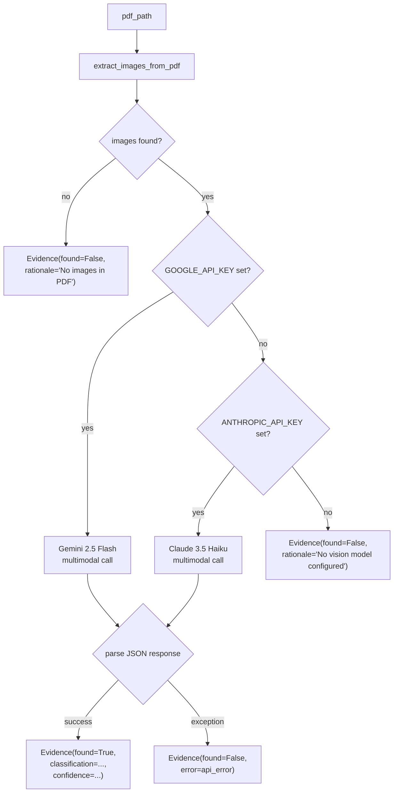

The vision model receives a structured prompt requesting a JSON response with `classification`, `description`, `has_parallel_branches`, and `confidence`. The five classification labels are aligned with the rubric's `swarm_visual` dimension:

| Label | Meaning |
|---|---|
| `accurate_stategraph` | Shows parallel fan-out/fan-in LangGraph nodes |
| `sequence_diagram` | UML sequence / step arrows |
| `generic_flowchart` | Flowchart without parallelism |
| `linear_pipeline` | Strictly sequential, no parallelism |
| `other` | Unclassifiable |

---

### 2.7 LLM Provider Selection for the Judicial Layer

The Judicial Layer uses LLMs to generate structured `JudicialOpinion` objects. Provider selection was driven primarily by **access at the time of project undertaking**, not by abstract benchmark comparisons.

**Primary constraint: existing subscription access**

At the start of this project, an active Anthropic subscription was already in place. This made Claude the zero-friction choice for all text reasoning tasks — no new billing setup, no quota approval wait, and predictable pricing already understood from prior use. OpenAI and Gemini were considered but would have introduced a new billing relationship purely for this project, which was not justified given that the Anthropic subscription already covered the required capability tier.

This is a real constraint that shaped the architecture: the three judge personas (`Prosecutor`, `Defense`, `Tech Lead`) are implemented against the `ChatAnthropic` client with `claude-3-5-sonnet-latest`, and the system has no OpenAI dependency for any reasoning task.

**Model tier within Anthropic: Sonnet for judges, not Haiku**

The cheapest available Anthropic model (Haiku) was tested for judge persona adherence and rejected for one specific reason: the `JudicialOpinion` schema requires a `cited_evidence: List[str]` field — the judge must quote the specific evidence IDs it is reasoning from, not just assign a score. In testing, Haiku produced arguments that omitted citation lists or cited only one evidence item regardless of how many were provided. Sonnet consistently cited the full set of relevant evidence, which the Chief Justice needs in order to apply its `Fact Supremacy` and `Variance Re-evaluation` override rules. The cost difference (~5× cheaper for Haiku) was not worth the structural failure mode.

**Vision: Gemini 2.5 Flash as primary**

`VisionInspector` uses a different provider entirely — Google's Gemini 2.5 Flash — rather than a second Anthropic call. The reasoning is twofold:

1. **Task fit.** Diagram classification is a bounded visual task: extract the image, identify whether the diagram shows parallel branches, return a label. Gemini 2.5 Flash is a natively multimodal model with strong vision benchmarks on diagram and chart understanding, accessible via the Google AI Studio API without a paid subscription tier for the volume this project requires.

2. **Provider boundary.** Keeping vision on a separate provider creates a natural isolation boundary: if the Anthropic API is unavailable or rate-limited during an audit run, the vision node continues to function independently. The fallback path degrades to Claude Haiku (§2.6) only when `GOOGLE_API_KEY` is absent, which is the less common case given Google AI Studio's free access tier.

A single Anthropic provider for both judges and vision was the simpler option but would mean a single API outage blocks the entire pipeline. Splitting by task type across two providers reduces that blast radius.

**API key dependency summary:**

| Use case | Primary | Fallback | Behaviour with no key |
|---|---|---|---|
| Judge personas (all three) | `ANTHROPIC_API_KEY` (Claude 3.5 Sonnet) | None | Node emits fallback `JudicialOpinion(score=1, argument="No LLM provider configured.")` |
| Vision diagram analysis | `GOOGLE_API_KEY` (Gemini 2.5 Flash) | `ANTHROPIC_API_KEY` (Claude 3.5 Haiku) | `Evidence(found=False, rationale="No vision model configured")` |

---

## 3. Interim StateGraph Flow

### 3.1 Node Topology

The interim graph implements **Layer 1 only**: the Detective Layer. The full judicial and synthesis layers are planned for the final submission.

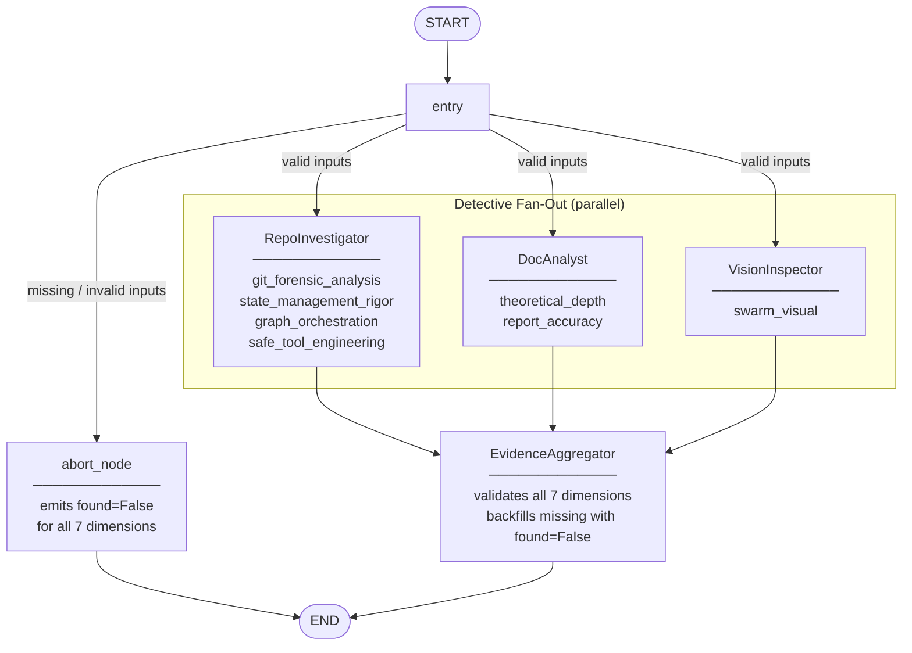

### 3.2 Conditional Edge Logic

The `entry_node` validates inputs before the detective fan-out:

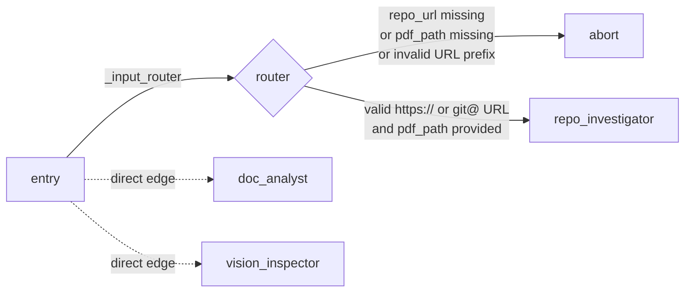

Note: `doc_analyst` and `vision_inspector` receive direct (non-conditional) edges from `entry` because they are independent of URL validity — the DocAnalyst and VisionInspector only require `pdf_path`. The conditional router gates only `RepoInvestigator`.

### 3.3 State Data Flow

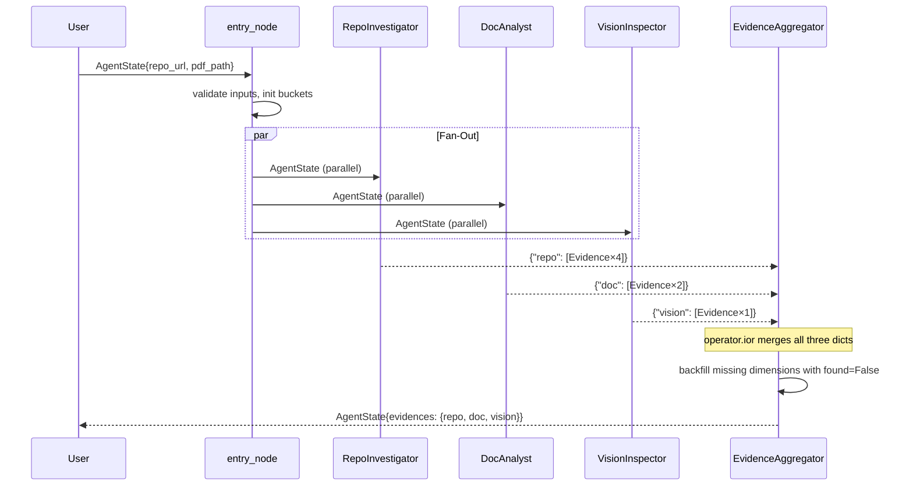

---

## 4. Rubric Dimension Coverage

The table below maps each rubric dimension to the detective node and tool function that collects it, along with the confidence heuristic applied:

| Dimension | Detective | Tool Function | Confidence Heuristic |
|---|---|---|---|
| `git_forensic_analysis` | RepoInvestigator | `extract_git_history` | 0.85 if ≥2 phases detected in commit messages; 0.4 otherwise |
| `state_management_rigor` | RepoInvestigator | AST scan of `src/state.py` | 0.9 if Pydantic + TypedDict + reducers all present; 0.5 otherwise |
| `graph_orchestration` | RepoInvestigator | `analyze_graph_structure` | 0.9 if fan-out AND fan-in detected; 0.5 otherwise |
| `safe_tool_engineering` | RepoInvestigator | `clone_repo_sandboxed` (self-audit) | 0.95 (constant — deterministic check) |
| `theoretical_depth` | DocAnalyst | `query_pdf` × 6 rubric queries | `matched_count / total_queries` |
| `report_accuracy` | DocAnalyst | `extract_file_paths_from_text` + path existence check | `verified_count / mentioned_count` |
| `swarm_visual` | VisionInspector | `extract_images_from_pdf` + `analyze_diagram` | LLM-reported confidence × 0.5 if not `accurate_stategraph` |

**Dimensions deferred to final submission** (Judicial Layer):

| Dimension | Target Detective/Judge | Notes |
|---|---|---|
| `structured_output_enforcement` | RepoInvestigator | Requires `src/nodes/judges.py` to exist in target repo |
| `judicial_nuance` | RepoInvestigator | Requires distinct judge persona prompts to scan |
| `chief_justice_synthesis` | RepoInvestigator | Requires `src/nodes/justice.py` to exist |

---

## 5. Known Gaps and Plan for Final Submission

### 5.1 Judicial Layer

**What is missing:** `src/nodes/judges.py` — three LangGraph node functions for the Prosecutor, Defense, and Tech Lead personas. Each reads the `evidences` dict from state and emits a `JudicialOpinion` per rubric criterion.

**Design (to be implemented):**

Each judge is an LLM chain bound to the `JudicialOpinion` schema via `.with_structured_output()`:

```python
prosecutor_chain = (
    ChatAnthropic(model="claude-3-5-sonnet-latest")
    .with_structured_output(JudicialOpinion)
)
```

The three personas receive the **same `Evidence` objects** but use **distinct, conflicting system prompts**:

| Persona | Core philosophy | Scoring bias |
|---|---|---|
| Prosecutor | "Trust No One. Assume Vibe Coding." | Penalises gaps, security flaws, laziness |
| Defense | "Reward Effort and Intent." | Credits struggle, iteration, deep understanding |
| Tech Lead | "Does it actually work? Is it maintainable?" | Pragmatic; tie-breaker role |

The judges run in **parallel fan-out** from `EvidenceAggregator`, using `operator.add` on `AgentState.opinions` so all three `JudicialOpinion` objects accumulate without overwriting each other.

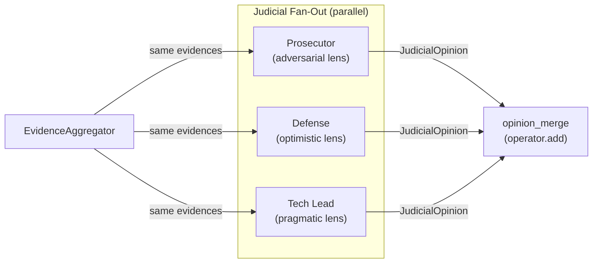

**Retry on structured output failure:**
If `.with_structured_output()` raises a `ValidationError` or returns `None`, the node retries up to 2 times before emitting a fallback `JudicialOpinion(score=1, argument="Parse failure — structured output not returned.", cited_evidence=[])`.

**Known risks in the judicial layer:**

| Risk | Description | Mitigation |
|---|---|---|
| Persona convergence | All three LLMs receive the same evidence and may produce scores within 1 point of each other regardless of persona instructions, making the `Variance Re-evaluation` rule never trigger and the dialectical structure decorative rather than functional. | System prompt engineering: each persona's prompt must include explicit scoring anchors ("a score of 5 from the Prosecutor is reserved for near-perfect implementations only") and anti-hedging instructions ("do not moderate your position toward the middle"). Scores will be logged per-run to detect convergence in practice. |
| Citation hallucination | The `cited_evidence: List[str]` field is type-valid when populated with IDs that do not correspond to any `Evidence` object in state. The Chief Justice's `Fact Supremacy` rule depends on citing real evidence; fabricated IDs silently corrupt that rule. | The `ChiefJusticeNode` will cross-reference every `cited_evidence` ID against `state["evidences"]` before applying rules. Any opinion citing a non-existent ID is flagged and its citations are treated as empty for the purposes of the `Fact Supremacy` check. |
| Score integer rounding | The weighted average (Prosecutor×0.3 + Defense×0.3 + TechLead×0.4) produces a float. Rounding `3.5` to `3` vs `4` changes the final `CriterionResult.final_score` and is currently unspecified. | Always use `round()` (banker's rounding in Python 3) and document the tie-break rule: ties round toward the TechLead score since it carries the highest weight. |

---

### 5.2 Chief Justice Synthesis Engine

**What is missing:** `src/nodes/justice.py` — the `ChiefJusticeNode` that resolves dialectical conflicts into a final `AuditReport`.

**Design (to be implemented):**

The Chief Justice does **not** call an LLM for its core logic. The conflict resolution is deterministic Python:

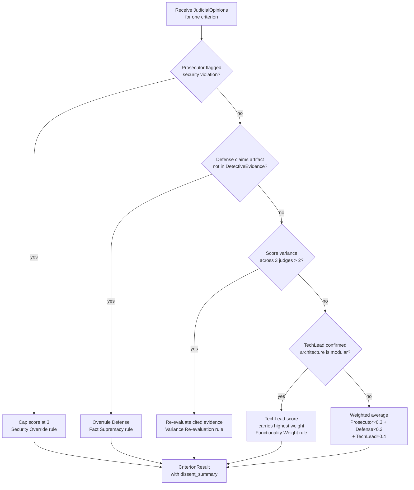

**Why deterministic Python rules rather than a fourth LLM call?**

The obvious alternative — passing all three `JudicialOpinion` objects to an LLM and asking it to synthesise a final score — was rejected for three reasons:

1. **Non-determinism.** Two consecutive runs on identical evidence can yield different final scores when synthesis is LLM-driven. An auditing system that produces different verdicts on the same input is not auditable. The hardcoded Python rules produce the same `CriterionResult` for the same inputs every time, which makes the system testable with `assert` statements.

2. **Accountability.** If a trainee disputes a score, "the LLM decided" is not an answer. The deterministic rules (`Security Override`, `Fact Supremacy`, `Variance Re-evaluation`, `Functionality Weight`) are named, version-controlled, and can be read directly. The audit trail is the code itself.

3. **Cost and latency.** The Judicial Layer already makes six LLM calls in parallel (three judges × two rubric dimensions per judge in the interim design, scaling to three judges × seven dimensions in the final). Adding a seventh LLM call per dimension for synthesis would roughly double the token spend with no accuracy benefit — the conflict-resolution logic is not creative reasoning; it is precedence application.

The LLM is reserved for tasks that require language understanding (interpreting evidence, constructing arguments). Arithmetic precedence rules belong in Python.

**Resolving the `Security Override` trigger — `security_flagged` field:**

The `Security Override` branch in the flowchart above fires on "Prosecutor flagged security violation." The current `JudicialOpinion` schema has no field for this signal — the only fields are `score`, `argument`, and `cited_evidence`. To make this rule implementable without keyword-scraping the `argument` string, the schema will be extended with a boolean field:

```python
class JudicialOpinion(BaseModel):
    judge: Literal["prosecutor", "defense", "tech_lead"]
    criterion_id: str
    score: int = Field(ge=1, le=5)
    argument: str
    cited_evidence: List[str]
    security_flagged: bool = False   # ← new: Prosecutor sets True for confirmed violations
```

The Prosecutor's system prompt will instruct the model to set `security_flagged=True` when it identifies a confirmed security violation (e.g., `shell=True` in subprocess calls, raw `os.system()`, unsanitised URL passed to git). The `ChiefJusticeNode` then evaluates:

```python
security_override = any(
    op.security_flagged
    for op in criterion_opinions
    if op.judge == "prosecutor"
)
if security_override:
    final_score = min(weighted_average, 3)  # cap at 3 per Security Override rule
```

This keeps the trigger condition in the Pydantic schema rather than in fragile string parsing.

**Resolving the `Variance Re-evaluation` implementation:**

The flowchart labels this branch "Re-evaluate cited evidence" without defining what that means in code. The `rubric.json` specifies: *"trigger a re-evaluation of the specific evidence cited by each judge before rendering the final score."* The concrete procedure is:

```python
def _variance_re_evaluation(
    criterion_opinions: List[JudicialOpinion],
    evidences: Dict[str, List[Evidence]],
) -> int:
    # 1. Collect all cited Evidence objects across opinions
    all_evidence_map = {e.goal: e for bucket in evidences.values() for e in bucket}

    adjusted_opinions = []
    for op in criterion_opinions:
        # 2. Check if cited IDs resolve to found=True evidence
        cited_found = [
            all_evidence_map[eid].found
            for eid in op.cited_evidence
            if eid in all_evidence_map
        ]
        # 3. If a judge cites only found=False evidence, demote their score by 1
        if cited_found and not any(cited_found):
            adjusted_opinions.append(op.model_copy(update={"score": max(1, op.score - 1)}))
        else:
            adjusted_opinions.append(op)

    # 4. Re-apply weighted average on adjusted scores
    weights = {"prosecutor": 0.3, "defense": 0.3, "tech_lead": 0.4}
    return round(sum(op.score * weights[op.judge] for op in adjusted_opinions))
```

The key invariant: re-evaluation does not call an LLM. It only adjusts scores for opinions whose cited evidence was not actually found by the detectives — implementing the `Fact Supremacy` principle at the score level.

**Dissent requirement:** Any criterion where `max(scores) - min(scores) > 2` must include a `dissent_summary` field in `CriterionResult` explaining which side was overruled and why.

**Output:** The node serialises `AuditReport` to a Markdown file under `audit/report_onself_generated/` or `audit/report_onpeer_generated/` depending on whose repo was audited.

---

### 5.3 Dynamic Rubric Loading

**What is missing:** A `ContextBuilder` / `Dispatcher` node that reads `docs/rubric.json` at runtime and distributes rubric forensic instructions to the correct detective before execution.

The `rubric.json` already exists at `docs/rubric.json` (version 3.0.0). It is the "Constitution" of the swarm — by separating rubric definitions from agent code, rubric updates (new dimensions, adjusted weights) can be applied without redeploying the graph.

**`rubric.json` schema:**

Each entry in `dimensions` follows this structure:

```json
{
  "id": "safe_tool_engineering",
  "name": "Safe Tool Engineering",
  "target_artifact": "github_repo",
  "forensic_instruction": "Scan src/tools/ for the repository cloning logic...",
  "success_pattern": "All git operations run inside tempfile.TemporaryDirectory()...",
  "failure_pattern": "Raw os.system(\"git clone <url>\") drops code into the live working directory..."
}
```

| Field | Type | Purpose |
|---|---|---|
| `id` | `str` | Stable key used as the `Evidence.goal` and `JudicialOpinion.criterion_id` |
| `name` | `str` | Human-readable label for reports |
| `target_artifact` | `"github_repo" \| "pdf_report" \| "pdf_images"` | Routes the dimension to the correct detective |
| `forensic_instruction` | `str` | Exact instructions passed to the detective's tool call |
| `success_pattern` | `str` | Positive match description used in the judge's system prompt |
| `failure_pattern` | `str` | Negative match description used in the judge's system prompt |

The top-level `synthesis_rules` object defines the five Chief Justice rules as named string descriptions:

| Key | Rule name | Applied in |
|---|---|---|
| `security_override` | Security Override | `ChiefJusticeNode` — cap score at 3 on `security_flagged=True` |
| `fact_supremacy` | Fact Supremacy | `ChiefJusticeNode` — overrule Defense if cited evidence is `found=False` |
| `functionality_weight` | Functionality Weight | `ChiefJusticeNode` — TechLead carries highest weight for `graph_orchestration` |
| `dissent_requirement` | Dissent Requirement | `CriterionResult.dissent_summary` populated when variance > 2 |
| `variance_re_evaluation` | Variance Re-evaluation | `_variance_re_evaluation()` triggered when `max - min > 2` |

**ContextBuilder / Dispatcher design (to be implemented):**

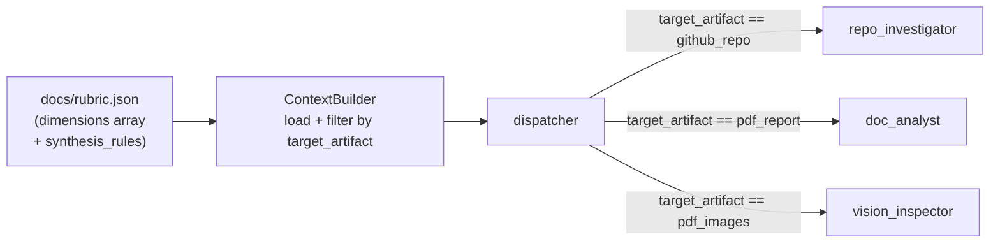

The `ContextBuilder` loads `rubric.json`, validates it against a Pydantic `RubricDimension` schema, and groups dimensions by `target_artifact`. The `Dispatcher` adds the relevant dimensions list to `AgentState.rubric_dimensions` before the detective fan-out. Each detective reads only the dimensions tagged for its artifact type, using `forensic_instruction` as the directive for its tool calls.

---

### 5.4 Implementation Sequence

The four gaps above have a strict dependency order. Attempting them out of sequence causes either import errors (nodes that reference schema fields not yet defined) or graph compilation errors (wiring nodes that don't exist).

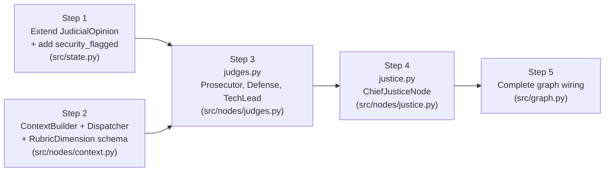

| Step | File | Depends on | Deliverable |
|---|---|---|---|
| 1 | `src/state.py` | Nothing | `JudicialOpinion` extended with `security_flagged: bool = False`; `RubricDimension` Pydantic model added |
| 2 | `src/nodes/context.py` | Step 1 (`RubricDimension`) | `ContextBuilderNode` loads `docs/rubric.json`, validates each dimension, groups by `target_artifact`, writes to `AgentState.rubric_dimensions` |
| 3 | `src/nodes/judges.py` | Steps 1 + 2 | Three node functions (`prosecutor_node`, `defense_node`, `tech_lead_node`), each bound to `JudicialOpinion` via `.with_structured_output()`, with retry logic |
| 4 | `src/nodes/justice.py` | Step 3 | `ChiefJusticeNode` with all five named rules, `_variance_re_evaluation()` helper, `dissent_summary` population, Markdown output |
| 5 | `src/graph.py` | Steps 2–4 | Full graph wired: ContextBuilder → Dispatcher → [Detectives ∥] → EvidenceAggregator → [Judges ∥] → ChiefJustice → ReportWriter |

**Open questions that require a decision before Step 4:**

- The `Variance Re-evaluation` rule re-scores based on cited evidence quality, but does the re-scored result feed back into the dissent check? If so, the dissent threshold must be evaluated on the *adjusted* scores, not the raw scores. The current plan assumes post-adjustment dissent evaluation.
- The `Functionality Weight` rule gives TechLead the highest weight specifically for the `graph_orchestration` criterion. Should it carry higher weight for *all* criteria, or only `graph_orchestration` as specified in `rubric.json`? The current plan scopes it to `graph_orchestration` only.

---

### 5.5 Complete Graph Wiring

The diagram below is the canonical reference for the full system. It satisfies all five architectural criteria simultaneously: both parallel fan-out/fan-in layers, a visually distinct aggregation node, data-type labels on all inter-layer edges, and the error/abort path for invalid inputs alongside the graceful-degradation paths within each layer.

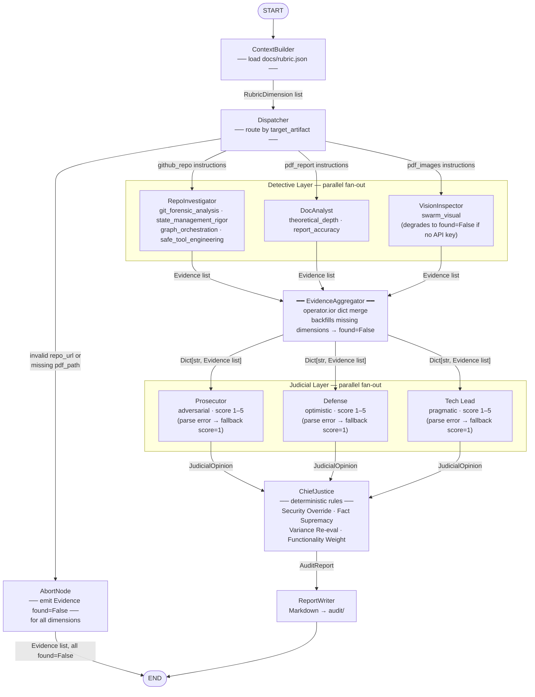

**Reading the diagram — five rubric elements:**

| Element | Where to look |
|---|---|
| Detective fan-out/fan-in | `Dispatcher` → three nodes in `Detective Layer` subgraph → `EvidenceAggregator` |
| Aggregation node (visually distinct) | `EvidenceAggregator` — bold border node between the two layers |
| Judge fan-out/fan-in | `EvidenceAggregator` → three nodes in `Judicial Layer` subgraph → `ChiefJustice` |
| Data types on edges | `RubricDimension list` · `Evidence list` · `Dict[str, Evidence list]` · `JudicialOpinion` · `AuditReport` |
| Error / abort paths | `Dispatcher →\|invalid inputs\| AbortNode → END` (hard abort); `(parse error → fallback score=1)` on each judge node (soft graceful degradation) |

---

## 6. Planned Final Architecture

The full architecture is summarised by this complete state-machine diagram:

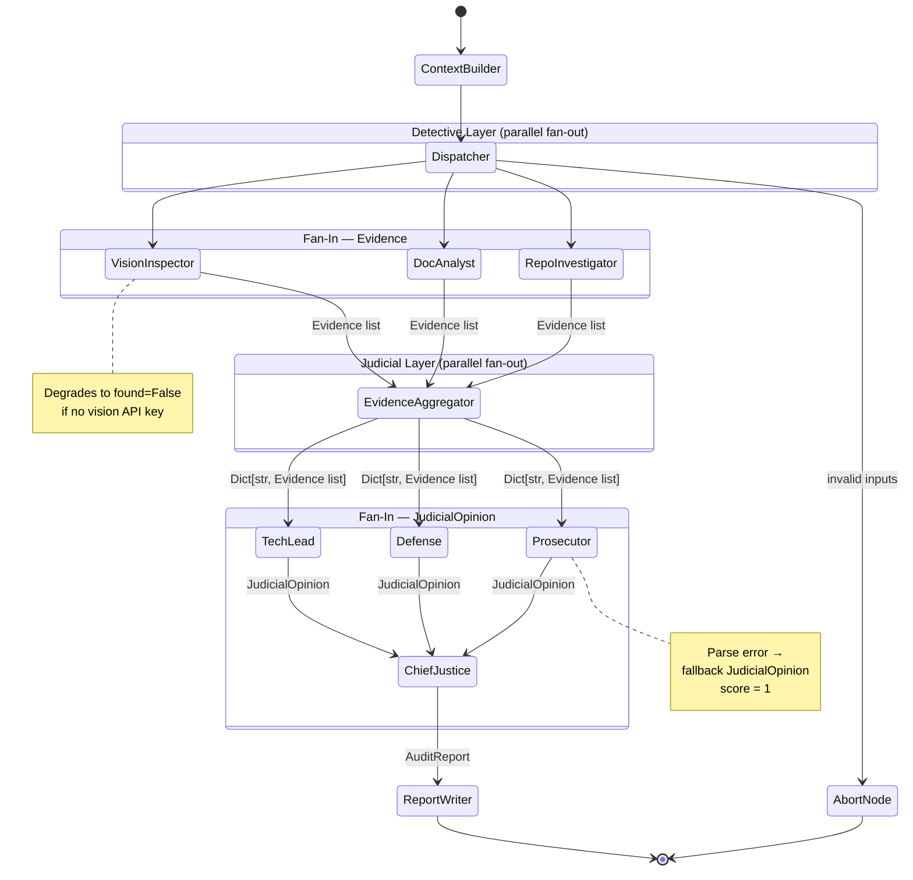

**Key properties of the full system:**

| Property | Implementation |
|---|---|
| Two parallel fan-out/fan-in layers | Detectives + Judges both run in parallel branches |
| Type-safe state throughout | Pydantic `BaseModel` for all value objects |
| No parallel overwrite | `operator.ior` (dicts) and `operator.add` (lists) reducers |
| Deterministic synthesis | Hardcoded Python rules in `ChiefJusticeNode`, not LLM prompts |
| Graceful failure | Every node catches exceptions; emits `found=False` Evidence |
| Structured output enforcement | `.with_structured_output(JudicialOpinion)` on all judge chains |
| Observable | LangSmith tracing via `LANGCHAIN_TRACING_V2=true` |

---

## 7. Environment and Observability

### Environment Variables

| Variable | Purpose | Required |
|---|---|---|
| `LANGCHAIN_TRACING_V2=true` | Enables LangSmith distributed tracing | No |
| `LANGCHAIN_API_KEY` | LangSmith authentication | No |
| `ANTHROPIC_API_KEY` | Claude 3.5 Sonnet for judge personas; Claude 3.5 Haiku as vision fallback | For judges |
| `GOOGLE_API_KEY` | Gemini 2.5 Flash for VisionInspector diagram analysis | For vision |

The `RepoInvestigator` and `DocAnalyst` operate entirely without LLM calls — they are deterministic forensic tools. `VisionInspector` requires `GOOGLE_API_KEY` for primary diagram classification and falls back to `ANTHROPIC_API_KEY` (Haiku) if unavailable. The Judicial Layer requires `ANTHROPIC_API_KEY` for all three judge personas; without it, each judge emits a score-1 fallback opinion.

### Observability Architecture

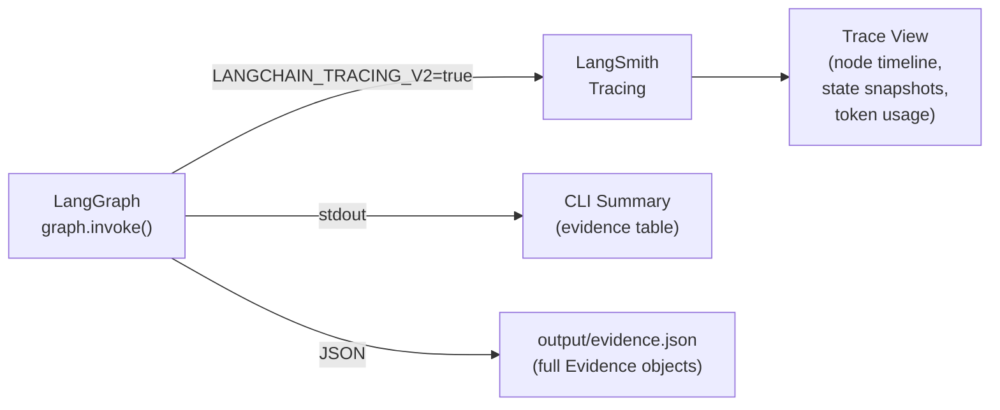

Each node execution is automatically captured as a LangSmith span, showing the input state, output state delta, and latency. This is essential for debugging the parallel fan-out — without it, determining which detective emitted which evidence (or failed silently) requires inspecting raw state diffs.

---

*Automaton Auditor — built with LangGraph, Pydantic v2, PyMuPDF, and uv.*
